# 🏛️ Nexus Protocol Architecture
**Spec Version:** v1.3.1 (Universal Edge Gateway)

> **Architectural Goal:** Move the "Trust Boundary" from centralized cloud RPCs to the physical device edge using a "Verify-then-Execute" (VTE) pattern.

---

## 1. High-Level Design
Nexus is designed as a **Unidirectional Data Pipeline**. It treats the physical node as a "Sovereign Castle" where the `Sentry` acts as the drawbridge.

### The "Verify-then-Execute" Flow
Requests are never processed directly. They must pass a cryptographic challenge at the edge before reaching the application state.

```mermaid
graph LR
    User((User / Device)) -->|Signed Payload| Sentry[🛡️ Sentry Guard]
    
    subgraph Sovereign_Node [Nexus Protocol Core]
        Sentry -->|Auth Pass| Brain[🧠 Nexus Brain]
        Brain -->|State Update| Vault[(💾 Local Vault)]
    end
    
    subgraph Adapters [🔌 Chain Interfaces]
        Vault -.->|Anchor| IOTX[IoTeX Adapter]
        Vault -.->|Anchor| TON[TON Adapter]
        Vault -.->|Anchor| SOL[Solana Adapter]
    end
```



---

## 2. Core Components

### 2.1 🛡️ The Sentry (Edge Firewall)
The Sentry is a **Fail-Closed** middleware. It does not know *what* the request does; it only verifies *who* sent it.
* **Responsibility:** Verifies cryptographic signatures (HMAC, Ed25519, Secp256k1).
* **Behavior:** If signature is invalid → Drop connection immediately (fail-closed). No state is touched.
* **Pluggability:** Supports hot-swapping auth modules, allowing seamless switching from one identity provider to another (e.g., ioID, DID-based schemes).

### 2.2 🧠 The Brain (Logic Engine)
The Brain is the deterministic state machine. It executes business logic *only* on verified requests.
* **Isolation:** Has no direct internet access; receives data only from the Sentry.
* **Reference Policy:** Currently enforces a reference **60-30-10 economic policy** used for deterministic testing (Revenue/Hardware/Community). This logic is modular and can be replaced for different protocol needs.
* **Determinism:** Given the same input sequence, the Brain produces the exact same state change on any architecture (x86/ARM).

### 2.3 💾 The Vault (State & Anchoring)
The Vault is a local SQLite ledger operating in **WAL (Write-Ahead Log)** mode for high concurrency.
* **Single Source of Truth:** The local database is authoritative. The blockchain is used for *verification*, not storage.
* **Merkle Anchoring:** The Vault aggregates state changes into a Merkle Tree. Only the **Root Hash** is sent to the Chain Adapter, ensuring privacy and low bandwidth.

---

## 3. The Adapter Pattern (Multichain Support)
Nexus avoids "Vendor Lock-in" by isolating blockchain logic into **Adapters**.

**Identity is pluggable.** Nexus requires only a cryptographic identity primitive; the specific provider (ioID, peaq ID, DID, or custom) is supplied by the adapter layer.

An Adapter is a simple Python class that implements the `Anchor` interface:
```python
class BaseAdapter:
    def get_latest_block(self):
        # Connect to specific chain RPC
        pass

    def anchor_state_root(self, merkle_root):
        # Send transaction to L1 Smart Contract
        pass
```

| Adapter | Status | Function |
| :--- | :--- | :--- |
| **TON** | Active | Anchors state via Jetton-compatible messages. |
| **IoTeX** | Staged | Uses **ioID** for device auth and **W3bstream** for data proofs. |
| **Solana** | Planned | Will utilize Compressed NFTs (cNFT) for low-cost state receipts. |

---

## 4. Security Model

| Attack Vector | Mitigation Strategy | Component |
| :--- | :--- | :--- |
| **RPC Hijacking** | Local-First State (No dependency on external RPCs) | `Vault` |
| **Spoofed Command** | Cryptographic Signature Enforcement | `Sentry` |
| **Replay Attack** | Nonce & Timestamp Windows | `Sentry` |
| **State Bloat** | Merkle Compression (Only roots leave the device) | `Vault` |

---

## 5. Directory Structure
The codebase reflects this separation of concerns:

```text
nexus-core/
├── backend/
│   ├── sentry.py       # Auth & Signature Verification
│   ├── brain.py        # Business Logic & Economics
│   └── vault.py        # Database & Merkle Tree
├── nexus/
│   └── adapters/       # Chain-Specific Logic
│       ├── ton.py
│       ├── iotex.py
│       └── template.py # Create your own!
└── frontend/           # Optional Visualization (Flutter)
```

---

<footer>
  <div align="center">
    <p>© 2026 Nexus Protocol · Open Standard for DePIN</p>
    <a href="LICENSE">Apache License 2.0</a>
  </div>
</footer>
