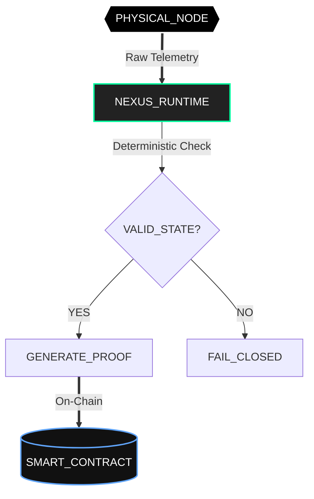

# Nexus Protocol (Core)
> **v1.4.0 [OPERATIONAL]** | *Sovereign Infrastructure Execution Layer*

[](LICENSE)
[](https://coreframe.systems)
[](https://iotex.io)

**Nexus Core** is the reference implementation of the sovereign gateway architecture developed by [Coreframe Systems](https://coreframe.systems). It defines the **Verify-then-Execute** standard for edge computing, allowing hardware to validate economic splits (60/30/10) locally—decoupling **Economic Determinism** from **Global Consensus**.

---

## 🏛️ Why Nexus Protocol for DePIN & Edge Infrastructure?
In a world of centralized cloud silos, high-value data and economic splits are often opaque, custodial, and fragile. Nexus solves this by moving the "Moment of Settlement" to the edge.

### 🎯 Who Nexus Is For
Nexus Protocol is designed for teams building **DePIN hardware**, **edge computing platforms**, and **machine-native economic systems** that require:
* **Local-First Execution:** Operating without cloud dependency or centralized RPCs.
* **Deterministic Settlement:** Enforcing economic rules (60/30/10) at the edge.
* **Verify-then-Execute:** Security guarantees that reject unverified commands before execution.
* **Bandwidth Optimization:** Reducing fraud and replay risk before data is anchored on-chain.

**Typical Adopters:**
* DePIN Protocol Teams (IoTeX, peaq-class networks).
* Edge Hardware Manufacturers requiring sovereign logic.
* Infrastructure Engineers building hardened gateways.

---

## 🏗 Architecture & Logic Flow
Nexus decouples the "Trust Layer" from the "Cloud Layer." Hardware nodes sign their own execution states using a local-first TEE (Trusted Execution Environment) logic.


```mermaid
graph TD
    %% NEXUS PROTOCOL LOGIC FLOW
    Hardware{{PHYSICAL_NODE}} ==>|Raw Telemetry| Runtime[NEXUS_RUNTIME]
    Runtime -->|Deterministic Check| Logic{VALID_STATE?}
    
    Logic -- YES --> Sign[GENERATE_PROOF]
    Logic -- NO --> Drop[FAIL_CLOSED]
    
    Sign ==>|On-Chain| Settlement[(SMART_CONTRACT)]
    
    style Hardware fill:#000,stroke:#fff,stroke-width:2px,color:#fff
    style Runtime fill:#222,stroke:#00ff9d,stroke-width:2px,color:#fff
    style Settlement fill:#111,stroke:#60a5fa,stroke-width:2px,color:#fff
```

---

## 🧩 Ecosystem Integration
* **For IoTeX (DePIN Logic):** Nexus acts as a local-first buffer for W3bstream. It ensures physical activity proofs are validated and partitioned with ACID integrity before hitting the chain.
* **For peaq (Machine Identity):** It enables "Verify-then-Execute" for machine-owners. Nexus resolves peaq IDs locally, ensuring rewards are calculated at the source.
* **For TON (Telegram Ecosystem):** Nexus transforms Telegram Mini Apps into "Stateless Surfaces"—reducing backend cost and failure domains.

---

## ⚡ Operational Status (Phase 1.4.0)
**Current State:** Stand-alone Sovereign Node.
* **Hardened Ingress:** Traffic filtered via Cloudflare Zero Trust.
* **Local Finality:** State persistence via SQLite WAL (Write-Ahead Logging).
* **Logic Gate:** The **Sentry Bridge** acts as a deterministic filter, ensuring only validated environmental contexts reach the core Brain.

> **Roadmap Note:** Phase 2.0 will evolve Nexus into a Cross-Machine Settlement Engine, anchoring local finality roots to multiple DePIN chains simultaneously.

---

## 🚀 Quick Start
*Prerequisites: Python 3.9+ | Linux/macOS (Recommended)*

### 1. Installation
```bash
# Clone the repository
git clone https://github.com/arhantbarmate/nexus-core.git
cd nexus-core

# Install dependencies
pip install -r requirements.txt
```

### 2. Launch Sovereign Node
Initialize the Brain, Sentry, and Tunnel layers:
```bash
# Linux/macOS
./start_nexus.sh

# Windows
start_nexus.bat
```

### 3. Verify Integrity
Run the baseline durability test to ensure the 60/30/10 invariant holds under load:
```bash
python scripts/stress_test_1m.py
```

---

## 📑 Documentation & Specs
| Foundational | Operational | Security |
| :--- | :--- | :--- |
| [Architecture](./docs/ARCHITECTURE.md) | [Installation](./docs/INSTALL.md) | [Security Policy](./docs/SECURITY.md) |
| [Economics](./docs/ECONOMICS.md) | [Roadmap](./docs/ROADMAP.md) | [Threat Model](./docs/THREAT_MODEL.md) |

---

## 🛡️ Security & Disclosure
Nexus implements a **Fail-Closed** security model. 
Please report vulnerabilities regarding the 60/30/10 Invariant via email.

**Contact:** `infrastructure@coreframe.systems`

---
<div align="center">
  <sub>Built by <a href="https://coreframe.systems">Coreframe Systems</a>. Powering the Sovereign Edge.</sub><br>
  <sub>Licensed under Apache 2.0</sub>
</div>
