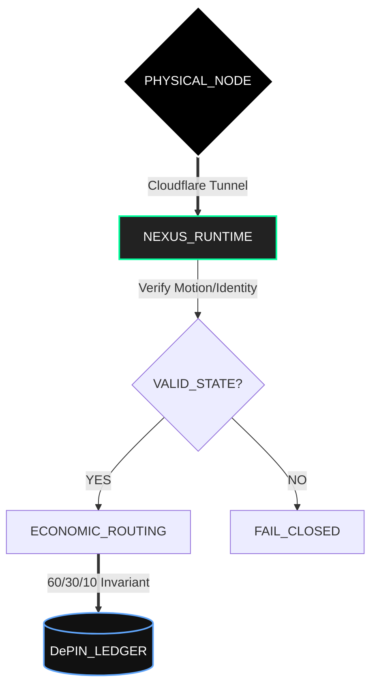



# Orthonode Infrastructure Labs™ | Nexus Protocol (Prototype)
> **v1.4.7 [ZERO-TRUST INGRESS]** | *Zero-Trust Edge Execution Layer*

**Orthonode Infrastructure Labs™** is a universal zero-trust gateway for DePIN hardware. By replacing ephemeral tunnels with a persistent **Cloudflare Zero-Trust Ingress**, Nexus establishes a hardened, identity-aware link between edge devices and the controller—enforcing the **Verify-then-Execute** standard at the point of ingress.

---

## 🏗️ Infrastructure Architecture: The Cloudflare Backbone
Nexus decouples the "Ingest Layer" from the public internet. All hardware nodes communicate through encrypted Cloudflare Tunnels, ensuring:
* **Zero-Exposure:** Devices remain behind NAT with no public IPs or open ports.
* **Identity-Gating:** Authentication is enforced at the Cloudflare Edge; only verified hardware can reach the Nexus Controller.
* **Deterministic Ingress:** A hardened pipe for local-first verification logic and status signaling.

---

## ⚡ Core Logic: Verify-then-Execute
Nexus moves the "Moment of Truth" to the edge. It validates physical sensor integrity and hardware context before triggering protocol-level execution.

```mermaid
graph TD
    %% Nexus Protocol (Prototype) LOGIC FLOW
    Hardware{PHYSICAL_NODE} ==>|Cloudflare Tunnel| Runtime[NEXUS_RUNTIME]
    Runtime -->|Verify Motion/Identity| Logic{VALID_STATE?}
    
    Logic -- YES --> Execute[ECONOMIC_ROUTING]
    Logic -- NO --> Drop[FAIL_CLOSED]
    
    Execute ==>|60/30/10 Invariant| Chain[(DePIN_LEDGER)]
    
    style Hardware fill:#000,stroke:#fff,stroke-width:2px,color:#fff
    style Runtime fill:#222,stroke:#00ff9d,stroke-width:2px,color:#fff
    style Chain fill:#111,stroke:#60a5fa,stroke-width:2px,color:#fff
```

---

## 📂 Implementation Branches & Legal
Nexus Protocol (Prototype) is modular. This repository contains the reference backbone and specific hardware runtimes:

* **[Hivemapper Bee Runtime](./hivemapper-bee-runtime):** Edge-based vibration entropy filtering for ARMv8 dashcams. [View Benchmarks](./hivemapper-bee-runtime/BENCHMARKS.md).
* **Nexus Controller:** The central engine managing secure ingress and settlement.
* **Documentation:** [Privacy Policy](./privacy.html) | [Terms of Service](./terms.html)

### 📜 Legal & Brand Provenance
**Orthonode Infrastructure Labs™** is a specialized engineering brand focused on the research and deployment of zero-trust hardware gateways for DePIN. 

Orthonode Infrastructure Labs™ operates as a technical initiative of **Orthonode Infrastructure Labs Private Limited**, an R&D-focused legal entity based in Madhya Pradesh, India (NIC 72900), dedicated to advancing edge verification systems, protocol research, and the Nexus execution framework.

---

## ⚡ Operational Status
* **Ingress:** Hardened via Cloudflare Zero Trust (Native Tunneling).
* **Execution:** Deterministic economic routing (**60/30/10 invariant** enforced at runtime).
* **Security:** **Fail-Closed Strategy.** If the verification heartbeat halts, the upload interface is programmatically disabled.

---

## 🛡️ Security & Disclosure
Nexus treats **data loss as preferable to reward leakage**. 
Report protocol-level vulnerabilities to: `infrastructure@orthonode.xyz`

---

  Engineered by <a href="https://orthonode.xyz">Orthonode Infrastructure Labs Private Limited</a>. Powering the Zero-Trust Edge.

---
© 2026 Orthonode Infrastructure Labs™ · All Rights Reserved  
Orthonode Infrastructure Labs™ is a technical brand and research initiative of **Orthonode Infrastructure Labs Private Limited**, Madhya Pradesh, India (NIC 72900).

