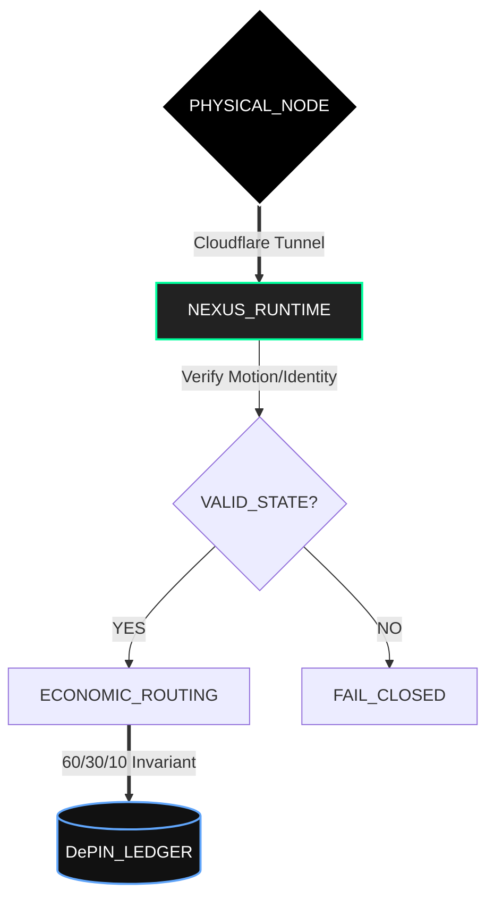

# Nexus Protocol: Zero-Trust Hardware Gateway
> **v1.4.7 [PRODUCTION INGRESS]** | *Zero-Trust Edge Execution Layer*

[](LICENSE)
[](https://cloudflare.com/products/tunnel/)
[](./hivemapper-bee-runtime)

**Nexus Protocol** is a universal zero-trust gateway for DePIN hardware. By replacing ephemeral tunnels with a persistent **Cloudflare Backbone**, Nexus establishes a hardened, identity-aware link between edge devices and the controller—enforcing the **Verify-then-Execute** standard at the point of ingress.

---

## 🏗️ Infrastructure Architecture: The Cloudflare Backbone
Nexus decouples the "Ingest Layer" from the public internet. All hardware nodes communicate through encrypted Cloudflare Tunnels, ensuring:
* **Zero-Exposure:** Devices remain behind NAT with no public IPs or open ports.
* **Identity-Gating:** Authentication is enforced at the Cloudflare Edge; only verified hardware can reach the Nexus Controller.
* **Deterministic Ingress:** A hardened pipe for local-first verification logic and telemetry.


---

## ⚡ Core Logic: Verify-then-Execute
Nexus moves the "Moment of Truth" to the edge. It validates physical sensor integrity and hardware context before triggering protocol-level execution.


```mermaid
graph TD
    %% NEXUS PROTOCOL LOGIC FLOW
    Hardware{PHYSICAL_NODE} ==>|Cloudflare Tunnel| Runtime[NEXUS_RUNTIME]
    Runtime -->|Verify Motion/Identity| Logic{VALID_STATE?}
    
    Logic -- YES --> Execute[ECONOMIC_ROUTING]
    Logic -- NO --> Drop[FAIL_CLOSED]
    
    Execute ==>|60/30/10 Invariant| Chain[(DePIN_LEDGER)]
    
    style Hardware fill:#000,stroke:#fff,stroke-width:2px,color:#fff
    style Runtime fill:#222,stroke:#00ff9d,stroke-width:2px,color:#fff
    style Chain fill:#111,stroke:#60a5fa,stroke-width:2px,color:#fff
```

---

## 📂 Implementation Branches (Use-Cases)
Nexus Protocol is modular. This repository contains the reference backbone and specific hardware runtimes:

* **[Hivemapper Bee Runtime](./hivemapper-bee-runtime):** Edge-based vibration entropy filtering to prevent reward leakage on ARMv8 dashcams.
* **Nexus Controller:** The central engine managing secure ingress, SQLite WAL persistence, and economic settlement.

---

## ⚡ Operational Status
* **Ingress:** Hardened via Cloudflare Zero Trust (Native Tunneling).
* **Execution:** Deterministic economic routing (60/30/10 invariant enforced at runtime).
* **Security:** **Fail-Closed Strategy.** If the verification daemon or heartbeat halts, the upload interface is programmatically disabled.

---

## 🚀 Quick Start

> **Note:** This quick start initializes the reference ingress and controller components for evaluation. Hardware-specific runtimes are launched from their respective implementation branches.

### 1. Installation
```bash
git clone https://github.com/arhantbarmate/nexus-core.git
cd nexus-core
pip install -r requirements.txt
```

### 2. Launch Secure Gateway
```bash
# Initializes the Cloudflare Ingress + Nexus Controller
./start_nexus.sh
```

---

## 🛡️ Security & Disclosure
Nexus treats **data loss as preferable to reward leakage**. 
Report 60/30/10 Invariant vulnerabilities to: `infrastructure@coreframe.systems`

---
<div align="center">
  <sub>Built by <a href="https://coreframe.systems">Coreframe Systems</a>. Powering the Zero-Trust Edge.</sub>
</div>
