# 🏛️ Nexus Protocol: Universal Edge Gateway
**The Sovereign Verification Layer for DePIN and DApps.**

[-violet)](docs/ARCHITECTURE.md)

> **Architectural Goal:** Move the "Trust Boundary" from centralized cloud RPCs to the physical device edge using a **"Verify-then-Execute" (VTE)** pattern.

---

## 🌍 The Universal Mission
Nexus is a **Local-First Sovereign Gateway** that sits between the chaotic internet and your critical logic. It acts as a firewall that verifies identity (Social, Machine, or Web3) *before* any state change occurs.

**Why?** Because decentralized apps (DePIN, Social, Compute) need a way to execute logic locally without relying on centralized API keys or constant on-chain gas fees.

[**🌐 View Visual Landing Page**](docs/index.html)

---

## 🏗️ High-Level Architecture

Nexus enforces a **Unidirectional Data Pipeline**. External traffic is treated as "Untrusted" until it passes the Sentry Guard.

```mermaid
graph LR
    User((User / Device)) -->|Signed Payload| Sentry[🛡️ Sentry Guard]
    
    subgraph Sovereign_Node [Nexus Protocol Core]
        Sentry -->|Auth Pass| Brain[🧠 Nexus Brain]
        Brain -->|State Update| Vault[(💾 Local Vault)]
    end
    
    subgraph Adapters [🔌 Universal Chain Interfaces]
        Vault -.->|Anchor| IOTX[IoTeX Adapter]
        Vault -.->|Anchor| TON[TON Adapter]
        Vault -.->|Anchor| PEAQ[✨ peaq Adapter]
    end
```

---

## ⚡ Key Features

| Component | Function | Status |
| :--- | :--- | :--- |
| **🛡️ Sentry Guard** | Validates signatures (HMAC, Ed25519) before execution. | **Active** |
| **🧠 Nexus Brain** | Deterministic state machine (e.g., 60-30-10 Reference Policy). | **Active** |
| **💾 Local Vault** | SQLite ledger with Merkle Root aggregation. | **Active** |
| **🔌 Adapters** | Plug-and-play interfaces for **peaq**, **IoTeX**, **TON**. | **Interface Ready** |

---

## 🚀 Getting Started

### 1. [Installation Guide](docs/INSTALL.md)
Deploy a Sovereign Node on your local machine using our **Tunnel-Ready** setup (ngrok).

### 2. [Architecture Deep Dive](docs/ARCHITECTURE.md)
Understand the "Verify-then-Execute" pattern and the Sentry design.

### 3. [Economic Reference Model](docs/ECONOMICS.md)
Learn about the "60-30-10" Reference Policy and how we handle value deterministically.

---

## 🔌 Ecosystem Compatibility

Nexus is **Chain-Agnostic** by design. We utilize an **Adapter Pattern** to anchor local state to the chain of your choice.

* **✨ peaq:** Targeted for Machine Identity (peaq ID) and storage.
* **🤖 IoTeX:** Targeted for W3bstream data proofs and ioID.
* **💎 TON:** Reference implementation for Social/User interaction history.
* **⚡ Solana:** Architecturally supported for high-frequency settlement.

---

## 📚 Documentation Index
* [**Installation**](docs/INSTALL.md)
* [**Architecture**](docs/ARCHITECTURE.md)
* [**Economics**](docs/ECONOMICS.md)
* [**Technical Novelty**](docs/NOVELTY.md)
* [**FAQ**](docs/FAQ.md)

---

## ⚖️ License
Nexus Protocol is open-source software licensed under the **Apache 2.0 License**.

**© 2026 Nexus Protocol · Open Standard**
