<div align="center">
  <h1>NEXUS PROTOCOL</h1>
  <p><b>Phase 1.3.1: The Sovereign Edge Gateway</b></p>

  [](https://github.com/arhantbarmate/nexus-core/actions)
  &nbsp;
  [](LICENSE)
  &nbsp;
  [](docs/ROADMAP.md)
  &nbsp;
  [](docs/ARCHITECTURE.md)
  
  <p><i>Fail-Closed Security · Local-First Sovereignty · Universal Anchoring</i></p>
</div>

---

## 🔎 What is Nexus Protocol?
**Nexus Protocol** is a universal infrastructure layer that hardens the "Trust Boundary" for DePIN (Decentralized Physical Infrastructure Networks). 

Most DePIN hardware relies on cloud RPCs to make decisions, creating a massive attack surface. Nexus moves the verification logic **directly onto the device**. It acts as a **"Verify-then-Execute"** gateway that sits between the external world and your hardware's logic.

* **Fail-Closed:** Unauthorized traffic is rejected at the Sentry layer before reaching application logic.
* **Chain Agnostic:** The core logic is isolated. Anchoring to a blockchain (IoTeX, TON, Solana, Monad, etc.) is handled via modular **Adapters**.
* **Local Sovereignty:** State is managed locally in a deterministic SQLite Vault. The node functions even if the internet goes down.

---

## 🏛️ Architecture: The "Verify-then-Execute" Model

The Nexus node enforces a strict unidirectional flow. No command is executed unless it passes the cryptographic `Sentry` check.

```mermaid
graph TD
    User((User / Device)) -->|Signed Request| Sentry[🛡️ Sentry Guard]
    
    subgraph Sovereign_Node [Nexus Protocol Core]
        Sentry -->|Auth Pass| Brain[🧠 Nexus Brain]
        Brain -->|Execute Logic| Vault[(💾 Local Vault)]
    end
    
    subgraph Adapters [🔌 Chain Adapters]
        Vault -.->|Anchor State| IOTX[IoTeX Adapter]
        Vault -.->|Anchor State| TON[TON Adapter]
        Vault -.->|Anchor State| ANY[Your Chain Adapter]
    end
```



---

## 🔌 Multichain & Identity Support
Nexus Core is designed to be **Universally Deployable**. The core logic (`Sentry`, `Brain`, `Vault`) does not care which blockchain you use.

**Identity is pluggable.** While `ioID` is the first planned implementation, additional hardware or machine identity systems (e.g., peaq ID, DID-based schemes, Solana Mobile Stack) can be integrated without changes to the execution core.

### Current Adapters
* **IoTeX:** (Staged) Uses `ioID` for hardware identity and `W3bstream` for data proofs.
* **TON:** (Active) Lightweight state anchoring via jetton-compatible patterns.
* **Generic:** You can write your own adapter in `nexus/adapters/` to anchor state to **any L1/L2** in under 50 lines of code.

---

## ⚡ Quick Start

### 1. Installation
Deploy a hardened node on any Linux environment (Ubuntu 20.04+ recommended).

```bash
# Clone the repository
git clone https://github.com/arhantbarmate/nexus-core.git
cd nexus-core

# Install dependencies (Virtual Environment recommended)
python3 -m venv venv
source venv/bin/activate
pip install -r requirements.txt
```

### 2. Configuration
Create your environment file to select your chain adapter.
```bash
cp .env.example .env
# Edit .env and set CHAIN_ADAPTER="iotex" (or "ton", "dummy", "solana")
```

### 3. Run the Sentry
Start the gateway. By default, it runs on port `8000`.
```bash
python main.py
```

---

## 🛡️ Security Model
Nexus operates on a **Zero-Trust** basis for incoming traffic.

| Component | Responsibility | Failure Mode |
| :--- | :--- | :--- |
| **Sentry** | Verifies Signatures (HMAC/Ed25519) | **Fail-Closed** (Drop packet) |
| **Brain** | Validates Business Logic | **Reject** (Return Error) |
| **Vault** | Commits State to Disk | **Rollback** (Atomic Write) |

> **Note:** This software is strictly **Infrastructure Research**. It does not perform on-chain settlement directly; it prepares verifiable proofs for anchoring.

---

## 🤝 Contributing (Add Your Chain)
We welcome contributions for new **Chain Adapters**! If you want to bring Nexus architecture to your ecosystem (Solana, Base, Monad, etc.):
1. Fork the repo.
2. Duplicate `nexus/adapters/template_adapter.py`.
3. Implement the `anchor_state()` method for your chain's SDK.
4. Submit a PR.

---

<footer>
  <div align="center">
    <p>© 2026 Nexus Protocol · Open Source under <b>Apache License 2.0</b></p>
    <a href="docs/INSTALL.md">Installation</a> · <a href="docs/ARCHITECTURE.md">Deep Dive</a>
  </div>
</footer>
