  <h1>NEXUS PROTOCOL</h1>
  
<b>Phase 1.3.1: Multichain Sovereign Gateway & Sentry</b>

  

  

  

  
  
  
<i>Sovereign Infrastructure · DePIN-Ready Identity · Perimeter Hardening</i>

---

## 🔎 Phase 1.3.1: Hardened Sovereign Node
**Current Milestone:** `v1.3.1-staged` | **Focus:** Multichain Perimeter Security & DePIN Readiness

Nexus Protocol is a **Local-First Sovereign Gateway** that moves the trust perimeter from the cloud to user-owned hardware. Phase 1.3.1 establishes the **Sentry Guard**, an active perimeter verification engine designed to enforce request legitimacy across heterogeneous networks (TON and IoTeX).

> [!IMPORTANT]
> **Execution Scope Disclaimer:** Phase 1.x performs **no on-chain execution or settlement**. All logic executes locally on user hardware. Blockchain networks (TON / IoTeX) are treated strictly as **future anchoring or identity layers**, not execution environments.

---

## 🏛️ Milestone Highlights
* **🛡️ Sentry Guard (`backend/sentry.py`):** An active perimeter module enforcing HMAC-SHA256 signature validation for TON. Its modular design is staged for **IoTeX ioID** hardware identity integration in Phase 2.0.
* **🔒 Fail-Closed Perimeter:** Unauthorized requests are rejected at the edge, ensuring that only cryptographically verified intents reach the internal state machine.
* **🧬 Deterministic Economics:** Every transaction follows a strictly audited 60-30-10 split, maintaining ledger invariants regardless of the eventual settlement chain.
* **🧠 Modular Authority:** Nexus treats the local **Vault** (SQLite) as the single source of truth; the **Brain** acts as the authoritative logic gate for the sovereign environment.

---

## 📖 Documentation Index

| 📚 Category | 📄 Document | 🔍 Description |
| :--- | :--- | :--- |
| **Start Here** | **[Installation Guide](docs/INSTALL.md)** | ⚡ Deploy a hardened node on Linux |
| **Deep Dive** | **[Architecture](docs/ARCHITECTURE.md)** | 🏛️ Sentry-Gated "Verify-then-Execute" design |
| **Logic** | **[Economic Model](docs/ECONOMICS.md)** | 💰 Deterministic 60-30-10 invariants |
| **Future** | **[Roadmap](docs/ROADMAP.md)** | 🗺️ From TON Gateway to IoTeX DePIN |
| **Governance**| **[Summary Map](docs/SUMMARY.md)** | 📋 Full repository and policy index |

---

## 🛡️ Hardened Architecture

```mermaid
graph TD
    User((User / Device)) -->|Signed Request| Sentry[🛡️ Sentry Guard]
    subgraph Sovereign_Node [Nexus Protocol Core]
        Sentry -->|Auth Pass| Brain[🧠 Nexus Brain]
        Brain -->|60-30-10 Logic| Vault[(💾 Nexus Vault)]
    end
    Vault -.->|Future Anchor| TON[TON Blockchain]
    Vault -.->|Future Anchor| IOTX[IoTeX Blockchain]
```

---

## 🚦 Quick Start

To deploy and audit the Phase 1.3.1 hardened codebase:

1. **Clone:** `git clone https://github.com/arhantbarmate/nexus-core`
2. **Setup:** Follow the **[Installation Guide](docs/INSTALL.md)** for Linux/Ubuntu.
3. **Verify:** Run `pytest tests/test_gateway.py` to confirm the Sentry is actively rejecting unauthorized traffic.

---

## 🗺️ Roadmap

---

<footer>
  

    
© 2026 Nexus Protocol · Licensed under <b>Apache License 2.0</b>

    <a href="docs/privacy.html">Privacy Policy</a> · <a href="docs/terms.html">Terms of Use</a>
  

</footer>
