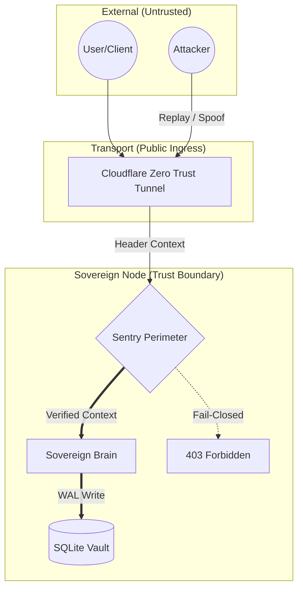

# 🛡️ Threat Model — Nexus Protocol
**Coreframe Systems Lab | Version 1.4.0**

This document defines the **explicit threat surface** and **security assumptions** of the Nexus Protocol. It tracks our evolution from "Project Discovery" to "Sovereign Infrastructure."

---

## 🎯 Security Objective
> **To preserve the integrity of the local economic ledger under adversarial request conditions, while failing closed on identity ambiguity.**

---

## 🛰️ Threat Surface Visualization

---

## 🏗️ The Infrastructure Evolution

Nexus is moving through three distinct "Ingress Epochs." Each shift resolves a previous vulnerability while introducing a managed trade-off.

| Epoch | Tech Stack | Pros | Cons (Threats) |
| :--- | :--- | :--- | :--- |
| **Phase 1.2** | **Ngrok** | Zero config; fast dev. | **Vulnerable:** Publicly indexed; browser interstitials. |
| **Phase 1.4.0** | **Cloudflare** | **Hardened:** Shielded IP; DDoS protection; WAF. | **Centralized:** Reliance on Cloudflare infrastructure. |
| **Phase 2.0+** | **Sovereign P2P** | **Total Sovereignty:** No middleman; DHT peer discovery. | **Research Mode:** High complexity; mesh-identity requirement. |

---

## ⚠️ Identified Threat ID System (Phase 1.4.0)

### T-01: Economic Tampering
**Threat:** Client attempts to alter the 60/30/10 split via request injection.  
**Mitigation:** Split logic is enforced **Brain-side only**. The vault ignores any split parameters supplied by the client.

### T-02: Ingress Spoofing (Sentry Guard)
**Threat:** Attacker bypasses the tunnel to hit the local port directly.  
**Mitigation:** The Sentry Perimeter is configured to **Fail-Closed**. Requests without the specific Zero Trust routing headers are rejected immediately.

### T-03: Database Integrity
**Threat:** Concurrent writes or power loss corrupting the ledger.  
**Mitigation:** **SQLite WAL Mode** combined with atomic integer-based math. Validated under **1-Million Transaction Stress Test**.

### T-04: Reliance on Ingress (Cloudflare)
**Threat:** Cloudflare experiences an outage or censors the node.  
**Mitigation:** **Accepted Risk for Phase 1.4.0.** The architecture is ingress-agnostic; operators can swap to Nginx or wait for Phase 2.0 P2P releases.

---

## 🛡️ Explicit Assumptions & Exclusions

* **The Insider Threat:** Malicious node operators are **out of scope** by design. Since the operator owns the hardware and the vault file, the protocol assumes the operator is the "Root of Trust" for their own data.
* **Adversarial Network Anonymity:** Nexus Phase 1.4.0 focuses on state correctness, not hiding the operator's IP from state-level actors.

---

## 🔐 Security Properties

| Property | Phase 1.4.0 Status | Mechanism |
|---|---|---|
| **Ledger Integrity** | ✅ **Verified** | 1M Stress Test & WAL Mode |
| **Crash Resilience** | ✅ **Verified** | ACID Transactions |
| **Fail-Closed Behavior**| ✅ **Verified** | Sentry Identity Resolution |
| **Crypto-Identity** | 🚧 **In Progress** | Deferred to Phase 2.0 (peaq/IoTeX) |

---
© 2026 Coreframe Systems · Threat Model v1.4.0  
*Hardening the edge, one epoch at a time.*
