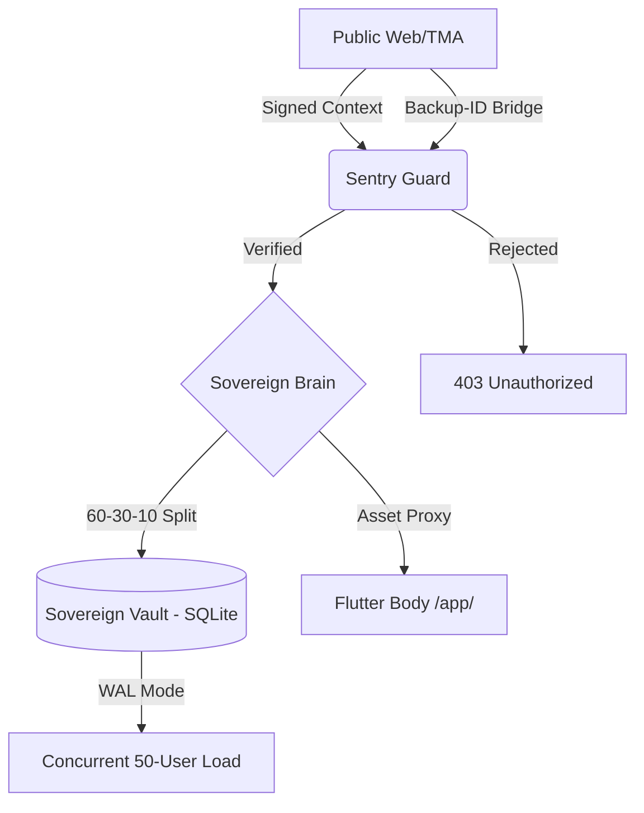

# 🧠 Nexus Protocol — The Sovereign Brain (v1.3.1)

The Nexus Brain is a high-performance, hardened FastAPI gateway serving as the economic and identity anchor of the Nexus Protocol. It executes the **60/30/10 Deterministic Split** and manages the **Sovereign Vault** with validated concurrency.

---

## 🏛️ System Architecture

The Brain operates as a unidirectional state machine. All incoming state transitions are filtered through the **Multichain Guard** before reaching the persistence layer.

---

## 💰 The 60/30/10 Economic Protocol
Every transaction processed by the Brain is bifurcated according to a deterministic execution logic:

| Recipient | Share | Purpose |
| :--- | :--- | :--- |
| **Creator Share** | 60% | Direct settlement to the content/node creator. |
| **User Pool** | 30% | Community redistribution and liquidity anchoring. |
| **Network Fee** | 10% | Protocol maintenance and DePIN anchoring. |

---

## 🛡️ Security & Identity
The Brain implements **Sovereign Identity Rescue**. It is designed to be container-agnostic:
1. **Primary:** Signed Mini App Context (TON-compatible) HMAC validation.
2. **Secondary:** Backup-ID Bridge for recovery and stress-test simulation.
3. **Resilience:** SQLite in **Write-Ahead Logging (WAL)** mode, verified under a 50-user concurrent settlement surge.

> [!IMPORTANT]
> **Phase 1.3.1 Alignment:** Current focus is on identity transport and deterministic settlement. On-chain anchoring and cryptographic finality are deferred to later phases (peaq/IoTeX integration).

---

## 🚀 Performance & Resilience Audit (Verified)
During the Phase 1.3.1 "Surge" Test, the Brain demonstrated:
* **Concurrency:** Stress-tested with 50 concurrent sovereign identities executing settlement operations without WAL lock contention or identity collision.
* **Deterministic Math:** 100% accuracy on 60/30/10 splits across all concurrent threads (Verified 100U -> 60/30/10 distribution).
* **Latency:** Average settlement latency measured at < 50ms in local sovereign test environments.

---

## 📊 API Specification (Internal)

| Endpoint | Method | Security | Description |
| :--- | :--- | :--- | :--- |
| `/api/execute_split/{amt}` | POST | Multichain Guard | Triggers 60/30/10 ledger entry for authed user. |
| `/api/vault_summary/{id}` | GET | Public/Resolved | Returns balance for a specific Sovereign ID. |
| `/api/transactions` | GET | Multichain Guard | Diagnostic endpoint: Lists the last N ledger entries for audit/testing. |

---

© 2026 Nexus Protocol · Built by **Arhant Barmate**
