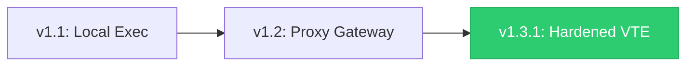

# 🧠 NEXUS BACKEND — SOVEREIGN BRAIN & SENTRY
**Focus:** Perimeter Enforcement · Identity Extraction · Vault Integrity  
**Status:** Phase 1.3.1 — Hardened Gateway (Active)

---

## 🚀 BACKEND EVOLUTION: FROM EXECUTION TO AUTHORITY

The Nexus backend has evolved from a permissive local executor into a cryptographically gated sovereign gateway. This shift marks the transition from "Trust-by-Default" to "Cryptographic-Certainty."


### 📈 Evolution Roadmap


| Version | Epoch | Authority Model | Data Integrity |
| :--- | :--- | :--- | :--- |
| **v1.1** | **Local Exec** | Trust all local calls | Direct SQLite writes |
| **v1.2** | **Proxy Gateway** | Trust proxy origin | Routed execution |
| **v1.3.1** | **Hardened** | **Verify-then-Execute** | **Identity-bound ledger writes** |

---

## 1. ARCHITECTURAL FLOW (FAIL-CLOSED)

The backend operates as a **Fail-Closed** system. If request legitimacy cannot be cryptographically established by the Sentry, the Brain refuses all interaction with the Vault.


### 🛡️ The Sentry Decision Matrix


---

## 2. CORE COMPONENTS

### 🛡️ THE SENTRY (`sentry.py`)
The Sentry is the sole perimeter authority for the Nexus node.

* **TON Gate (Active):**
    * Validates Telegram Mini App signatures using the `BOT_TOKEN` secret.
    * Extracts `user_id` from signed payloads to prevent identity spoofing.
* **IoTeX Gate (Staged):**
    * Recognizes `X-Nexus-IOTX` headers but marks them as `verified=False`.
    * **Strict Denial:** Explicitly denies execution in Phase 1.3 to ensure "Fail-Closed" security until ioID integration is finalized.
* **Test Instrumentation:**
    * Deterministic CI behavior via mocking ensures security logic is verified in every build without insecure production bypasses.

### 🧠 THE BRAIN (`main.py`)
The Brain is the execution authority, but never the verifier. It trusts only the context provided by the Sentry.

* **Verify-then-Execute Enforcement:** All sensitive routes require Sentry approval via FastAPI `Depends`.
* **Identity-Bound Execution:** Ledger entries in the Vault are written under the verified `user_id`.
* **Atomic Economics:** Enforces the 60% Creator / 30% Pool / 10% Fee invariant.

### 💾 THE VAULT (`nexus_vault.db`)
The Vault is the authoritative local ledger.


* **Local-First Persistence:** SQLite-based, operator-owned data store.
* **WAL Mode:** Enabled for high-performance concurrent safety.
* **Anchoring-Ready:** Schema is compatible with future Merkle root generation for future L1 anchoring / settlement.

---

## 3. MULTICHAIN ROADMAP (BACKEND)


> [!IMPORTANT]
> **Explicit Non-Goals (Phase 1.3):** No replay protection, no keypair identity, no on-chain execution, and no cross-node consensus. All balances are tracked in the local Vault.

---

## 4. CI / TESTING STATUS

Backend correctness and security perimeters are enforced via automated tests:

* **`test_main.py`**: Verifies backend bootstrap and confirms the Sentry perimeter is active on startup.
* **`test_gateway.py`**: Verifies:
    * **Fail-Closed behavior:** 403 Forbidden when headers are missing.
    * **TON Authorization:** Success and identity extraction.
    * **IoTeX Staging:** Confirms requests are recognized but correctly denied.

----------------------------------------------------
© 2026 Nexus Protocol · Sovereign Backend Documentation
Apache License 2.0
```