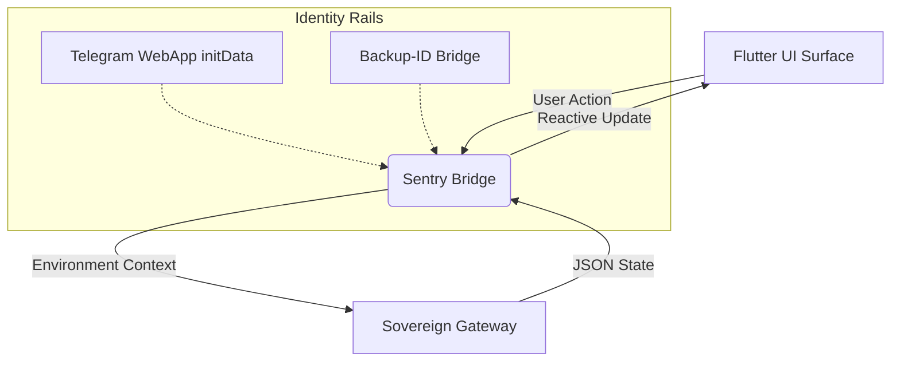

# 📱 Nexus Protocol — The Sovereign Body (v1.3.1)

The Nexus Body is a cross-platform Flutter interface built on **Flutter 3.38.6 Stable**. It serves as the interaction surface for the **60/30/10 Economic Protocol**, providing a stateless UI for Telegram Mini App (TMA) and standard Web environments.

---

## 🏛️ UI/UX Architecture

The Body is architected as a "Stateless Surface." It extracts environmental context and delegates all cryptographic and economic logic to the Sovereign Brain.



---

## 🛰️ The Sentry Bridge (v1.3.1)
The Client-side Sentry (implemented in ```tg_bridge_web.dart```) acts as the environment sensor:
* **Context Extraction:** Extracts and forwards Telegram WebApp ```initData``` for server-side verification.
* **Fail-Closed Logic:** Reverts to **Sovereign Simulation Mode** (Backup-ID) if a secure container is not detected.
* **Base-Href Isolation:** Optimized for deployment at ```/nexus-core/app/```.

---

## 🚀 Build & Deployment Specs

### 1. Production Build (Universal)
To ensure correct pathing within the Nexus Gateway, use the following build command:
```bash
flutter build web --release --base-href "/nexus-core/app/" --no-tree-shake-icons
```

### 2. Deployment Pathing
The compiled assets must be mounted in the Sovereign Brain's ```test_client``` directory or served via the ```staging/app/``` path in GitHub Pages.

---

## 📊 Performance Metrics (Verified)
* **Handshake Overhead:** Negligible client-side overhead during Sentry environment validation.
* **Compatibility:** Fully verified on Flutter 3.38.6 for Chrome (Desktop) and Telegram Webview (iOS/Android).
* **Render Stability:** Stable rendering under rapid successive state updates during simulated ledger activity.

---

© 2026 Nexus Protocol · Built by **Arhant Barmate**
