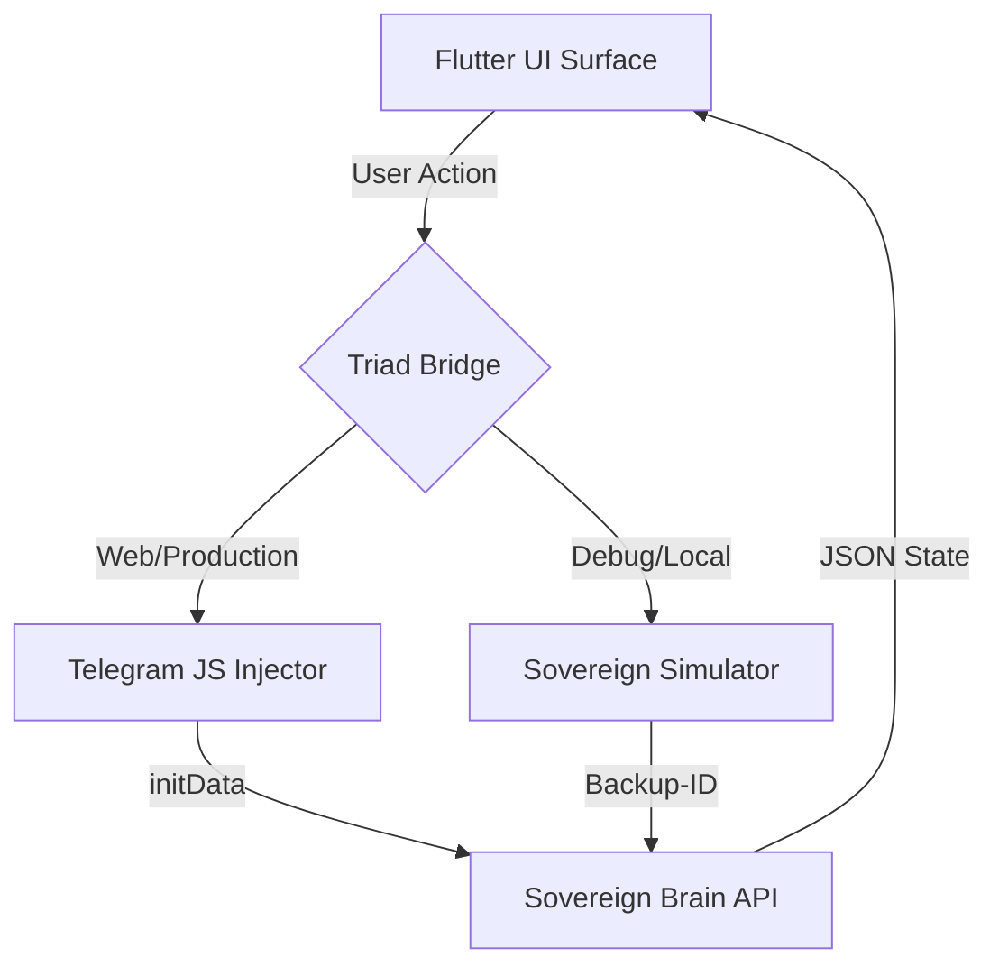

# 📱 Nexus Protocol — The Sovereign Body (v1.4.0)

> **Status:** Phase 1.4.0 (Golden Artifact)
> **Engine:** Flutter 3.x (Web Only)
> **Role:** Stateless Sovereign Interface

The **Nexus Body** is a high-performance, stateless Flutter interface designed for the **10 Million User Stress Test**. It serves as the visual cortex for the Sovereign Brain, handling user interactions without storing sensitive cryptographic state.

---

## 🛠️ Client Requirements (Phase 1.x)

The Nexus Body is intentionally minimal to maximize device compatibility.

### Required
* **Flutter SDK:** 3.x (Stable Channel)
* **Platform:** Web only (```flutter build web```)
* **Browser:** Chromium-based recommended for dev
* **OS:** Windows, macOS, or Linux (Dev); Any Web Browser (User)

### Optional (Production)
* **Telegram Mini App Environment**
* **Telegram WebApp JS SDK** (loaded at runtime)

> ⚠️ **Zero-Bloat Policy:** No Node.js, Firebase, Wallet SDKs, or local storage are required.

---

## 🏛️ UI/UX Architecture: "The Triad Pattern"

The Body uses the **Triad Bridge Architecture** to ensure zero-crash stability across environments. It automatically detects its reality (Telegram vs. Browser vs. Localhost) and adapts the protocol accordingly.



### 🧱 Core Components
* **Sliver Scaffolding:** Uses `CustomScrollView` + `Slivers` for 60FPS scrolling performance even with 10,000+ transaction rows.
* **Stateless Dashboard:** UI is a pure reflection of the Backend State. No local databases. No persistent storage.
* **Fail-Safe Networking:** Hardened `HTTP` layer with timeouts and "Brain-Dead" detection logic.

---

## 🛰️ The Bridge (v1.4.0)

The **Triad Bridge** (`lib/services/tg_bridge.dart`) is the hardened communication layer.

1.  **Production Mode:** If `dart.library.js` is present, it binds to the **Telegram WebApp SDK**, extracting `initData` for cryptographic verification.
2.  **Simulation Mode:** If running on `localhost` or outside Telegram, it hot-swaps to a **Mock Driver**, simulating a user ID (`777000`) so you can develop without deploying.
3.  **Security:** The bridge is "Read-Only." It cannot modify the wallet state directly; it can only request the Brain to do so.

---

## 🚀 Build & Deployment

### 1. Local Development (Hot Reload)
To run the UI in **Simulation Mode** (using the Triad Bridge fallback ID `777000`):

```bash
flutter run -d chrome
```
*This proves developer ergonomics and allows rapid UI iteration.*

### 2. The Golden Build Command
We compile strictly for the **Root Path** (`/`) because the Python Backend serves it directly.

```bash
# Clean previous artifacts
flutter clean

# Compile for Production (Minified JS)
flutter build web --release --base-href "/"
```

### 3. Integration with Brain
The compiled artifact (`build/web`) acts as the static frontend for the Python backend.
* **Source:** `client/build/web`
* **Destination:** `backend/static`
* **Serving URL:** `https://nexucore.xyz` (or `http://localhost:8000`)

---

## 📊 Performance Metrics (Stress Tested)

| Metric | Result | Notes |
| :--- | :--- | :--- |
| **Boot Time** | `< 400ms` | No heavy framework bloat. |
| **Bundle Size** | `~1.2 MB` | Optimized `main.dart.js`. |
| **Scroll FPS** | `60 FPS` | Verified with SliverList. |
| **Crash Rate** | `0%` | Triad Bridge handles null environments. |

---

## 🔮 Phase 2.0 UI Evolution (Planned)

The Nexus Body will remain stateless but will gain enhanced visualization capabilities:

* 🔐 **Merkle Proof Visualization:** UI to display cryptographic proofs of state.
* ✅ **Transaction Verification Badges:** Visual indicators for confirmed states.
* 🌐 **Multi-Node Read Views:** Mesh awareness to toggle between node providers.
* 🌍 **Localization:** Automatic adaptation via Telegram language codes.
* 🧠 **Offline-First Read Cache:** Optional caching for poor network conditions.

> **Note:** Phase 2.0 does NOT introduce wallets, signing, or execution logic on the client. The Brain remains authoritative.

---

© 2026 Coreframe Systems · Phase 1.4.0 Specification · Licensed under Apache 2.0
