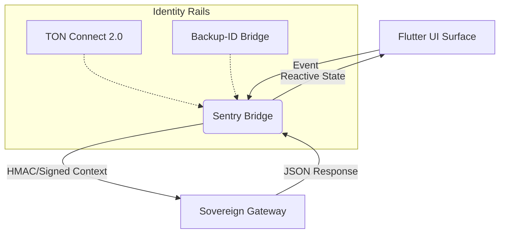

# 📱 Nexus Protocol — The Sovereign Body (v1.3.1)

The Nexus Body is a cross-platform Flutter interface designed for the **Nexus Universal Gateway**. It serves as the primary interaction surface for the **60/30/10 Economic Protocol**, featuring a hardened identity bridge for Telegram Mini App (TMA) and Web environments.

---

## 🏛️ UI/UX Architecture

The Body is architected to be "Chain-Agnostic." It does not store private keys; instead, it signs context via the **Sentry Bridge** and delegates state persistence to the Sovereign Brain.



---

## 🛰️ The Sentry Bridge (v1.3.1)
The Client-side Sentry (implemented in ```tg_bridge_web.dart```) acts as the security perimeter:
* **Context Anchoring:** Automatically extracts and validates init data from the hosting container.
* **Fail-Closed Logic:** If the bridge cannot verify the environment, the UI reverts to **Sovereign Simulation Mode** (Backup-ID).
* **Base-Href Isolation:** Optimized for deployment at ```/nexus-core/app/``` to allow side-by-side documentation hosting.

---

## 🎨 Phase 1.3.1 Surface Features
* **Deterministic Ledger Dashboard:** Real-time visualization of 60/30/10 splits.
* **Vault Explorer:** Deep-dive into local Sovereign Vault balances.
* **Multichain Identity Switcher:** Toggle between live identity environments and local simulation for rapid development.
* **Responsive Layout:** Hardened for Mobile (TMA), Tablet, and Desktop Chrome environments.

---

## 🚀 Deployment & Build Logic

### 1. Build for Sovereign Gateway
To match the Nexus Protocol pathing logic, the body is compiled with a specific base-href:
```bash
flutter build web --release --base-href /nexus-core/app/
```

### 2. Environment Configuration
The Body respects the following Dart defines:
* ```NEXUS_DEV=true```: Enables the Backup-ID Bridge UI.
* ```CHAIN_MODE=dummy|ton```: Forces the initial adapter state.

---

## 📊 Performance Verified (Internal Audit)
During the Phase 1.3.1 internal audit:
* **Handshake Latency:** < 100ms from UI trigger to Sentry validation.
* **State Sync:** Atomic updates to the local ledger visualization without frame drops.
* **Compatibility:** Verified across Telegram Desktop, iOS, and Android webviews.

---

© 2026 Nexus Protocol · Built by **Arhant Barmate**
