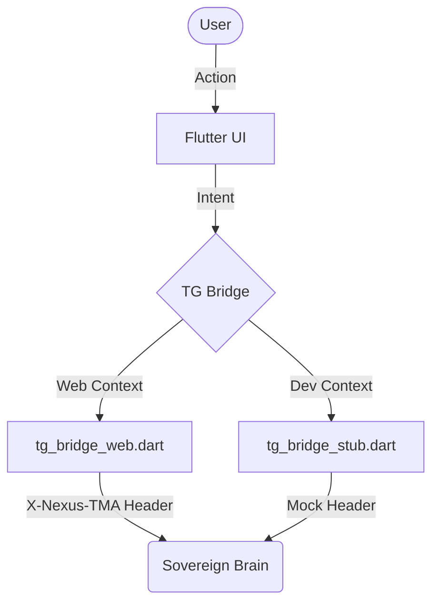
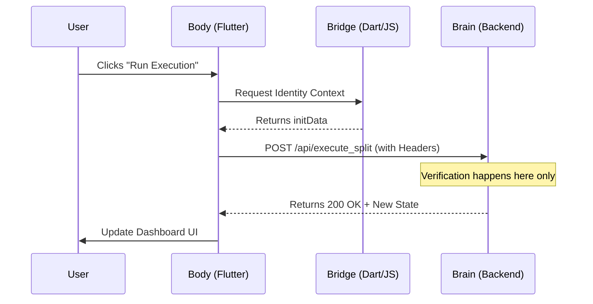

# 🖥️ NEXUS BODY — STATELESS CLIENT (FLUTTER)
**Focus:** Presentation · Intent Forwarding · Environment Bridging  
**Status:** Phase 1.3.1 — Non-Authoritative Body (Active)

---

## 🚀 CLIENT PHILOSOPHY: THIN BODY, SOVEREIGN BRAIN

The Nexus Body is a stateless client layer designed for maximum portability and zero authority. In the Nexus architecture, the Body is "blind" to security and economics; it serves only to visualize the state of the Brain and forward user intent.

### 🏛️ The "Thin-Body" Architecture




---

## 1. ARCHITECTURAL ROLE

The Body’s responsibilities are intentionally minimal to ensure the integrity of the protocol remains independent of the interface.

* **UI Rendering:** Presents balances, transactions, and system state returned by the Brain.
* **Intent Forwarding:** Forwards user actions to the Brain as HTTP requests with environment-provided context headers (e.g., Telegram `initData`).
* **Environment Bridging:** Detects the runtime environment (Telegram Mini App vs. Local Dev) and adapts the data-bridge accordingly.

> [!CAUTION]
> **The Body never mutates state directly.** All authority for state changes resides in the Sovereign Brain.

---

## 2. TELEGRAM BRIDGE ARCHITECTURE


The client uses a platform-abstracted bridge to maintain a clean separation between UI logic and environment-specific APIs.

* **`tg_bridge.dart`**: Defines the abstract interface used by the UI.
* **`tg_bridge_web.dart`**: Active in Telegram WebApp environments. It reads `window.Telegram.WebApp.initData` and forwards it as the `X-Nexus-TMA` header.
* **`tg_bridge_stub.dart`**: Used for local development and CI. It provides deterministic mock values to enable UI testing without a Telegram environment.

---

## 3. SECURITY MODEL (INTENTIONAL LIMITATIONS)

The Body provides no security guarantees by itself. This "weak-by-design" approach ensures that even a compromised client cannot manipulate the protocol's economic invariants.

| Capability | Body (Client) | Brain (Backend) |
| :--- | :---: | :---: |
| **Identity Verification** | ❌ | ✅ |
| **Cryptographic Checks** | ❌ | ✅ |
| **Economic Execution** | ❌ | ✅ |
| **Ledger Persistence** | ❌ | ✅ |

---

## 4. REQUEST FLOW (INTENT FORWARDING)




---

## 5. MULTICHAIN POSITIONING

In Phase 1.3.1, the Body is **Chain-Agnostic**.
* It does not store private keys, seeds, or wallet credentials.
* All multichain logic and header recognition are handled server-side by the Sentry.

> [!IMPORTANT]
> **Explicit Non-Goals (Phase 1.3):** The Body does not perform signing, replay protection, identity storage, or cryptographic verification. Authority remains rooted in the Sovereign Brain.

---

## 6. BUILD & DEPENDENCIES

* **Framework:** Flutter Web
* **Bridge:** Custom JS/Dart Telegram Bridge
* **Secrets:** Zero (No private keys or API secrets stored in client)
* **Authority:** None (Stateless)

----------------------------------------------------
© 2026 Nexus Protocol · Stateless Client Documentation
Apache License 2.0
```