# 📱 Nexus Client (Stateless Body v1.3)

The **Nexus Client (Body)** is a high-performance, stateless user interface for the Nexus Protocol. It serves as the visual interface for the **Sovereign Brain**, operating under a strict "Zero Authority" model.

---

## 📌 Phase Status

- **Phase 1.2:** Proxy target & dynamic routing — **Closed**
- **Phase 1.3:** Sentry alignment & Request Legitimacy — **Current (Active)**

---

## 🏗️ Architecture: The Sentry Handshake (Phase 1.3)

In Phase 1.3, the Body is "Sentry-Aware." While it still has zero economic authority, it now carries the **Request Legitimacy Payload** required to pass through the Brain's perimeter.

```mermaid
graph TD
    User((User)) -->|Telegram WebApp| Body["📱 Body (Observer)"]
    Body -->|1. Inject initData| Header["🛡️ X-Nexus-TMA Header"]
    Header -->|2. Request| Sentry["🧠 Sentry (Guard)"]
    Sentry -->|3. Verify HMAC| Brain["🧠 Brain (Logic)"]
    Brain -->|4. Authorized State| Body
```



---

## ⚡ Phase 1.3 Capabilities

### 🛡️ Sentry-Aware Handshaking
The client is now configured to extract the `initData` provided by the Telegram environment and inject it into the `X-Nexus-TMA` header. This enables the Brain to:
- Validate that requests originated from a Telegram WebApp context associated with the Mini App.
- Verify request integrity at the protocol boundary before execution.

### Environment-Aware Routing
The client automatically adapts its API base path:
* **Local/Dev:** `http://127.0.0.1:8000/api`
* **Production/Hosted:** Relative path `/api` (via Gateway Proxy).

### Platform Guarding (TMA Discipline)
The Client uses conditional imports to ensure it only attempts to access Telegram-specific features when running inside the TMA environment, preventing crashes in desktop browsers.

---

## 🚀 Quick Start

### Prerequisites
* Flutter SDK (3.x stable)
* A running Nexus Brain (v1.3) on port 8000

### Installation & Launch
```bash
cd client
flutter pub get

# Must run on port 8080 for the Brain's Reverse Proxy to find it
flutter run -d web-server --web-port 8080 --web-hostname 0.0.0.0 --release
```

---

## 🔐 Security & Isolation Model

### 1. Zero Authority UI
The Body remains a **Stateless Observer**. It cannot write to the database or compute economic values. The Client does not verify signatures or make trust decisions; all security decisions occur within the Brain’s Sentry layer.

### 2. Header Discipline
The Client does not manage session cookies or passwords. It relies entirely on the **Sentry's HMAC-SHA256 verification** of the Telegram-provided signature.

### 3. Scope Discipline (Phase 1.3)
- [X] **Legitimacy Check:** Implemented via `X-Nexus-TMA` (Payload Delivery).
- [ ] **Cryptographic Ownership:** Deferred to Phase 2.0.
- [ ] **On-Chain Anchoring:** Deferred to Phase 2.0.

---

## 🧭 Roadmap Alignment

- [x] **Phase 1.2** — Proxy target & dynamic routing (Closed)
- [x] **Phase 1.3** — **Sentry alignment & Request Legitimacy (Current)**
- [ ] **Phase 2.0** — Ed25519 Request Signing & TON Anchoring

---


**© 2026 Nexus Protocol** | Licensed under the Apache License 2.0