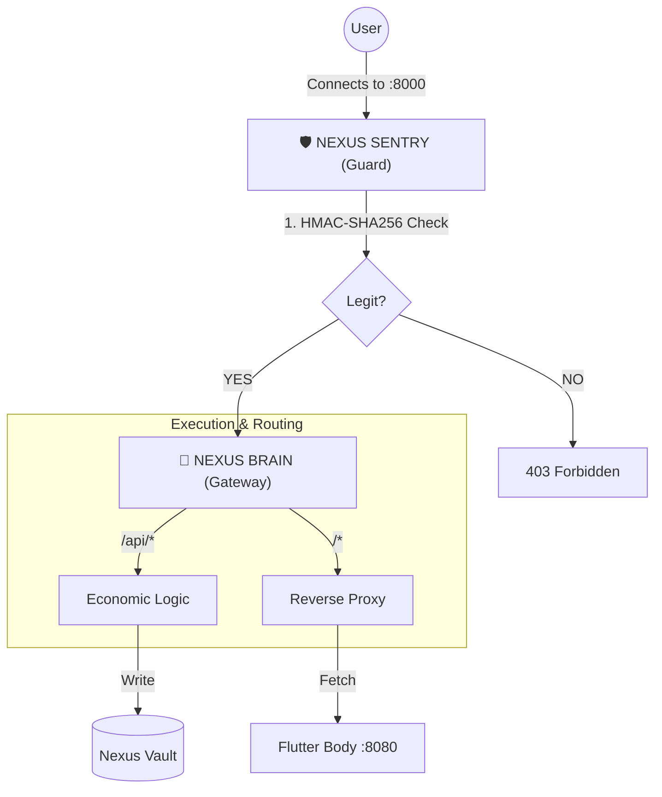

# Nexus Protocol — Technical Architecture (Phase 1.3)

This document describes the **Hardened Gateway Architecture** of Nexus Protocol Phase 1.3.

It explains how the system achieves environment-consistent execution and perimeter security across **Localhost**, **Ngrok bridge**, and **Telegram WebApp** through a deterministic verification layer.

---

## 1. Architectural Philosophy: The Sentry Model

In Phase 1.3, Nexus evolves from a basic proxy layout to a **Hardened Sentry Model**.

**Core principles:**

1.  **Deterministic Perimeter**
    The system introduces the **Sentry**, a deterministic verification guard that validates Telegram WebApp–provided integrity signatures (initData) before requests reach the execution engine.

2.  **Separation of Concern with Authority**
    - **THE SENTRY (Perimeter):** Validates request legitimacy.
    - **THE BRAIN (Authority):** Executes deterministic economic logic.
    - **THE BODY (Observer):** Visualizes state with zero authority.

3.  **Protocol Discipline**
    Request legitimacy is established at the protocol boundary (HMAC-SHA256) rather than through centralized session management.

---

## 2. High-Level Architecture

The system enforces a strict "Fail-Closed" security posture. Malformed or unsigned requests are rejected at the perimeter.

---

## 3. Component Breakdown

### 3.1 The Sentry — Request Validation (New in 1.3)
**Role:** The perimeter guard for the protocol.
- **HMAC-SHA256 Handshake:** Validates `initData` signatures using a secret key derived from the `BOT_TOKEN`.
- **Timing-Safe Comparison:** Uses `compare_digest` to prevent side-channel attacks during verification.
- **Request Legitimacy:** Ensures the request originated from a Telegram WebApp context associated with the Mini App.
- **Roadmap Extension:** Replay protection and freshness checks are planned extensions of the Sentry in later Phase 1.3 iterations.

### 3.2 The Brain — Sovereign Gateway (FastAPI)
**Role:** The single source of truth and traffic controller.
- **Unified Namespace:** Enforces a shared ledger namespace (`NEXUS_DEV_001`).
- **Atomic Execution:** Applies deterministic **60-30-10** logic.

### 3.3 The Vault — Persistent Ledger (SQLite)
**Role:** The authoritative economic record.
- **WAL Mode:** Ensures atomic commits and non-blocking writes.

### 3.4 The Body — Stateless Proxy Target (Flutter)
**Role:** A passive UI layer carrying the **Request Legitimacy Payload**.
- **Header Discipline:** Injects the `X-Nexus-TMA` header into all outgoing requests.

---

## 4. Data Flow & Security

### 4.1 Security Envelopes (Phase 1.3)
- **Perimeter Guarding:** Requests are rejected *before* reaching the Economic Engine if the signature is invalid.
- **Zero Authority UI:** The Body cannot verify signatures or make trust decisions; all security decisions occur within the Brain’s Sentry layer.
- **Isolation:** The Sentry does not establish user identity, authorization, or ownership; it only validates request legitimacy at the protocol boundary.

---

## 5. Roadmap Alignment
- [x] **Phase 1.2** — Gateway Proxy & Architectural Authority (Closed)
- [x] **Phase 1.3** — **Sentry Implementation & Perimeter Hardening (Current)**
- [ ] **Phase 2.0** — Ed25519 Request Signing & TON Anchoring

---

© 2026 Nexus Protocol