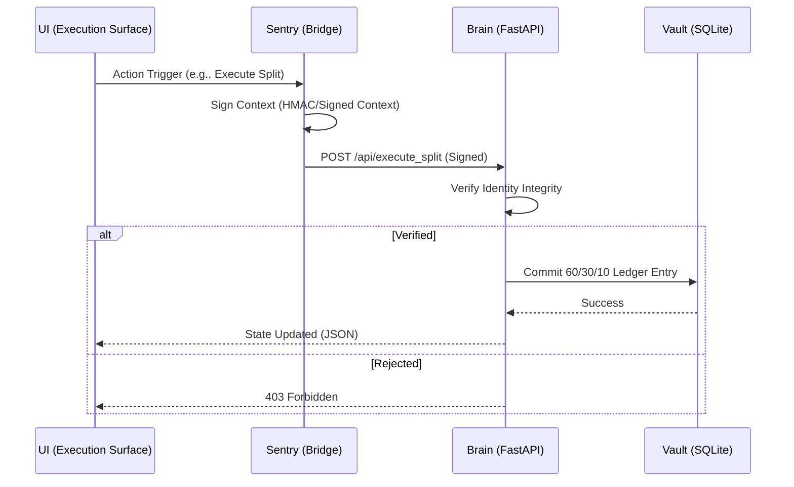

# 🏛️ System Architecture — Nexus Protocol (v1.3.1)

The Nexus Protocol is a **Sovereign Edge Gateway** architected for the DePIN ecosystem. It operates on a **Verify-then-Execute** model, ensuring that economic state transitions are only committed after identity validation through the Sentry Bridge.

---

## 🛰️ High-Level Logic Flow
The following sequence defines the "Fail-Closed" lifecycle of a Nexus transaction:



---

## 🧠 The Brain (Persistence & Logic)
The backend is a **Unidirectional State Machine** built with FastAPI and SQLite.
* **Concurrency:** Utilizes **Write-Ahead Logging (WAL)** mode. Successfully verified under a **50-user concurrent identity surge** without lock contention.
* **Ledger Invariant:** Every incoming credit is strictly bifurcated via the **60/30/10 Protocol**:
    * **60% Creator:** Direct node/content settlement.
    * **30% User Pool:** Community redistribution.
    * **10% Network Fee:** Protocol maintenance.

## 📱 The Body (Interface & Sentry)
The frontend is a Flutter-based **Execution Surface** that interacts with the Brain through the **Sentry Bridge (Fail-Closed Identity Perimeter)**.
* **Identity Rails:** Abstracted adapter pattern currently supporting TON Connect 2.0 and the Sovereign Backup-ID Bridge.
* **Structural Isolation:** Compiled with ```base-href /nexus-core/app/``` to ensure operational separation from the documentation portal.

---

## 🛡️ Infrastructure Sovereignty
* **Ngrok Bypass:** Implements a **Sovereign Sentry Page** to handle Ngrok's free-tier interstitial, ensuring seamless headless handshakes for Telegram Mini Apps.
* **Local-First:** Designed to run on low-power edge hardware (Raspberry Pi/Local PC) to maintain data ownership.

---

© 2026 Nexus Protocol · Architecture Specification v1.3.1
