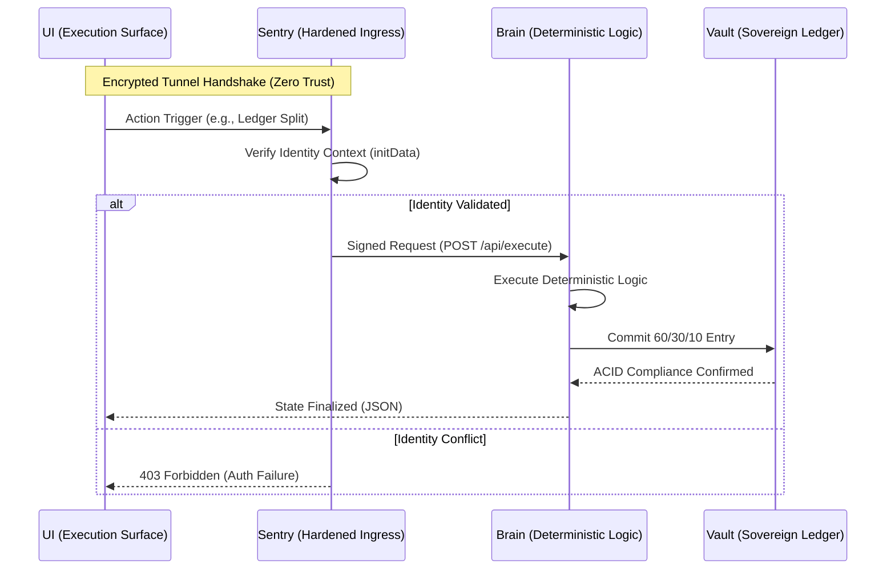

# 🏛️ System Architecture — Nexus Protocol
**Coreframe Systems Lab | Phase 1.4.0**

The Nexus Protocol is a **Sovereign Edge Gateway** architected for the DePIN ecosystem. It operates on a **Verify-then-Execute** model, ensuring that economic state transitions are only committed after environmental and identity resolution.

---

## 🛰️ High-Level Logic Flow: The "Sovereign Handshake"
The following sequence defines the "Fail-Closed" lifecycle of a Nexus transaction. Every request is treated as untrusted until the **Sentry Bridge** validates the environment context.



---

## 🧠 The Brain: Deterministic State Machine
The core logic engine is a **Unidirectional State Machine** built for absolute persistence and auditability.

* **Concurrency Control:** Utilizes **Write-Ahead Logging (WAL)** mode. Verified via a **1-Million Transaction stress test** to ensure zero write-collisions on edge hardware.
* **Auditability:** Execution events are locally logged and replayable for deterministic audit and post-incident analysis.
* **Ledger Invariants:** Every transaction follows a strict **60/30/10 Allocation Protocol**:
    * **60% Settlement:** Direct node/content provider allocation.
    * **30% Redistribution:** User/Community yield pool.
    * **10% Protocol:** Network maintenance & sustainability.


## 📱 The Body: Execution Surface & Sentry
The interface is a Flutter-based **Execution Surface** that exists entirely behind the **Sentry Bridge**.

* **Identity Rails:** Native support for Telegram WebApp ```initData``` and **Sovereign Backup-ID Bridges** for local-first simulation and recovery.
* **Path Isolation:** Environment variables ensure the Body only communicates through the hardened ingress, preventing "Side-Channel" data leakage.

---

## 🛡️ Infrastructure Sovereignty
* **Tunneling Resilience:** Optimized for Zero Trust Tunnels (Reference Implementation: Cloudflare Tunnel). Designed to be replaceable by self-hosted reverse proxies (e.g., Nginx/Traefik) in future sovereign deployments.
* **Legacy Bypass:** Engineered to eliminate "interstitial" handshakes common in free-tier tunneling services, ensuring seamless headless communication for Telegram Mini Apps.
* **Deterministic Recovery:** The Vault is portable. In a "Total Hardware Failure" scenario, the ```.db``` file can be re-anchored to any Coreframe-compliant node without state loss.

---
© 2026 Coreframe Systems · All Rights Reserved
