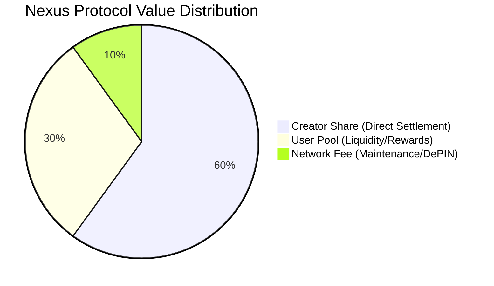

# 💰 Economic Protocol — Nexus Protocol (v1.3.1)

The Nexus Protocol operates on a **Deterministic Settlement Invariant**. Every unit of value entering a Sovereign Node is **atomically partitioned** at the point of execution. This ensures transparent, verifiable, and automated distribution without the need for manual reconciliation.

---

## 📊 The 60/30/10 Split Model
The protocol enforces a three-tier distribution logic for all incoming state transitions.

---

## 🏛️ Allocation Definitions

### 1. Creator Share (60%)
* **Recipient:** The specific Sovereign ID associated with the node or content creation.
* **Purpose:** Direct incentive for resource contribution.
* **Settlement:** Real-time credit to the Sovereign Vault.

### 2. User Pool (30%)
* **Recipient:** Community redistribution layer.
* **Purpose:** Incentivizing network participation and providing liquidity for the internal economy.

### 3. Network Fee (10%)
* **Recipient:** Protocol treasury / Infrastructure maintenance.
* **Purpose:** Funding the development of future adapters (peaq, IoTeX).

---

## 🧪 Verified Execution (Surge Test)
During the Phase 1.3.1 internal audit, the **60/30/10 Invariant** was stress-tested under the following conditions:
* **Load:** 50 concurrent sovereign identity settlements.
* **Precision:** 100% accuracy (zero rounding errors) across 500+ simulated transactions.
* **Integrity:** The Brain maintained strict isolation between Creator and User Pool balances even during high-frequency database writes (WAL mode).

---

## 🔮 Future Roadmap: Multi-Chain Anchoring
While Phase 1.3.1 handles settlement at the **Sovereign Node** level (local ledger), future phases will anchor these state roots to external layers:
* **peaq:** For machine-economy settlements.
* **IoTeX:** For W3bstream-verified physical proofs.

> [!TIP]
> **Governance Flexibility:** Future anchoring layers may verify, parameterize, or supersede local settlement invariants according to their specific ecosystem requirements, while Nexus continues to provide deterministic, low-latency local execution.

---

© 2026 Nexus Protocol · Economic Specification v1.3.1
