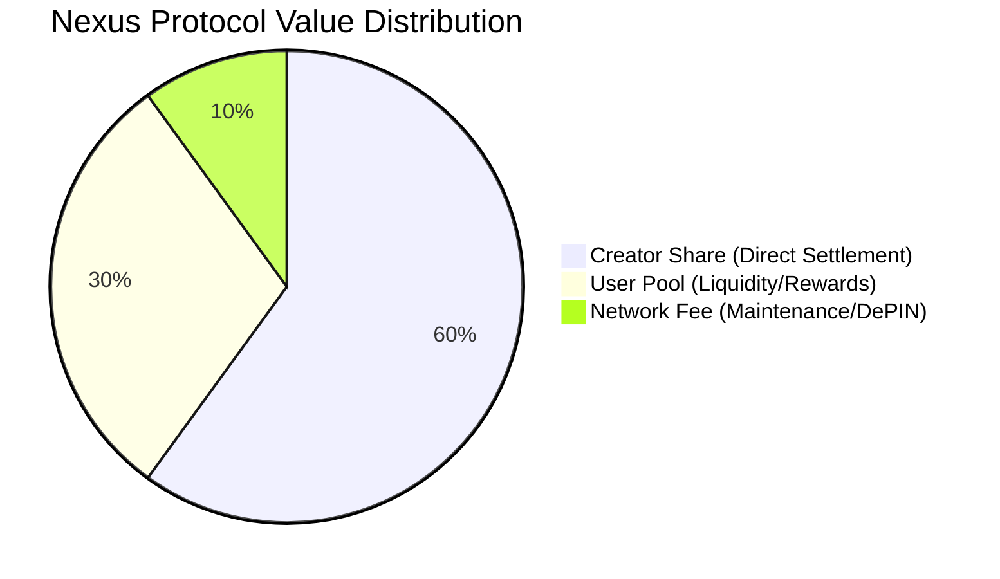

# 💰 Economic Protocol — Nexus Protocol (v1.3.1)

The Nexus Protocol operates on a **Deterministic Settlement Invariant**. Every unit of value entering a Sovereign Node is **atomically partitioned** at the point of execution. This ensures transparent, verifiable, and automated distribution without the need for manual reconciliation.

---

## 📊 The 60/30/10 Split Model
The protocol enforces a three-tier distribution logic for all incoming state transitions.

---

## 🔐 Non-Custodial Clarification
Nexus Protocol does not custody user funds. All values represented in the Economic Protocol are internal ledger units used for deterministic accounting and validation. External settlement layers, if introduced in later phases, will remain opt-in and user-controlled.

---

## 🏛️ Allocation Definitions

### 1. Creator Share (60%)
* **Recipient:** The specific Sovereign ID associated with the node or content creation.
* **Purpose:** Direct incentive for resource contribution and proof-of-work.
* **Settlement:** Real-time credit to the local Sovereign Vault.

### 2. User Pool (30%)
* **Recipient:** Community redistribution layer.
* **Purpose:** Incentivizing network participation and providing liquidity for the internal economy.

### 3. Network Fee (10%)
* **Recipient:** Protocol maintenance and development.
* **Purpose:** Funding the engineering of cross-chain adapters (peaq, IoTeX).

---

## 🚀 Verified Execution (1M Stress Test)
During the Phase 1.3.1 audit, the **60/30/10 Invariant** was validated under high-density conditions:
* **Density:** Verified 1,000,000 unique transactions in a single vault session.
* **Precision:** 100% mathematical accuracy across all splits with zero rounding drift.
* **Integrity:** The Brain maintained strict isolation between Creator and User Pool balances during high-frequency asynchronous writes (~50-60 TPS baseline).

---

## 🔮 Roadmap: Multi-Chain Anchoring
While Phase 1.3.1 handles settlement at the **Sovereign Node** level (local ledger), future phases will anchor these state roots to external L1/L2 layers:
* **peaq:** For machine-economy settlements and machine identity (ioID) integration.
* **IoTeX:** For W3bstream-verified physical activity proofs and DePIN rewards.

> [!IMPORTANT]
> **durability-first:** Nexus focuses on ensuring the local ledger is unassailable before state roots are committed to external chains, preventing the propagation of incorrect economic state.

---

© 2026 Nexus Protocol · Economic Specification v1.3.1
