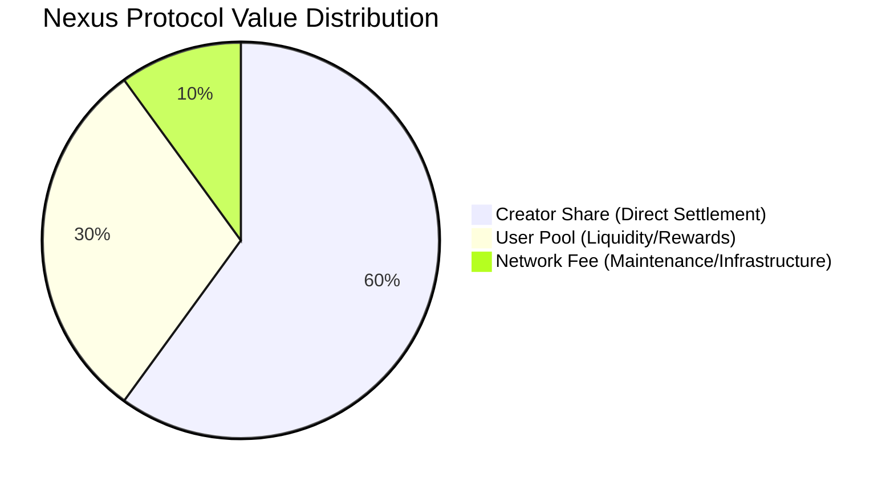

# 💰 Economic Protocol — Nexus Protocol
**Coreframe Systems Lab | Version 1.4.0**

The Nexus Protocol operates on a **Deterministic Settlement Invariant**. Every unit of value entering a Sovereign Node is **atomically partitioned** at the point of execution. This ensures transparent, verifiable, and automated distribution without the need for manual reconciliation.

---

## 📊 The 60/30/10 Split Model
The protocol enforces a three-tier distribution logic for all incoming state transitions. This is the core economic axiom of the Coreframe ecosystem.

---

## 🔐 Accounting & Trust Boundaries
Nexus Protocol acts as a **Deterministic Ledger Engine**. 
* **Internal Units:** All values represented are internal ledger units used for accounting and validation.
* **Non-Custodial:** The protocol does not custody external assets. It maintains the "Source of Truth" for how those assets should be distributed upon final settlement.
* **Atomic Execution:** Splits are calculated and written in a single database transaction to prevent partial state updates.

---

## 🏛️ Allocation Definitions

### 1. Creator Share (60%)
* **Target:** The Sovereign ID associated with the specific resource or content contribution.
* **Function:** Direct incentive for proof-of-work and resource allocation.
* **Finality:** Real-time credit to the local Sovereign Vault.

### 2. User Pool (30%)
* **Target:** Community redistribution and participation layer.
* **Control Model:** Distribution rules are deterministic and protocol-defined; no discretionary allocation occurs at runtime.
* **Function:** Incentivizing network engagement and providing liquidity for the internal economy.

### 3. Network Fee (10%)
* **Target:** Infrastructure maintenance and adapter development.
* **Function:** Reserved for protocol-defined infrastructure costs, adapter maintenance, and long-term sustainability.

---

## 🚀 Verified Integrity (1M Stress Test)
The **60/30/10 Invariant** has been validated under extreme concurrent load to ensure mathematical precision:

* **Volume:** 1,000,000 unique transactions in a single vault session.
* **Method:** Integer-based accounting primitives prevent floating-point drift under concurrent execution.
* **Precision:** Zero rounding drift across the entire 1M transaction set.
* **Reliability:** The Brain maintained strict isolation between Creator and User Pool balances during high-frequency asynchronous writes (~50-60 TPS baseline on edge hardware).

---

## 🔮 Roadmap: Multi-Chain Anchoring
While Phase 1.4 handles settlement at the **Sovereign Node** level (local-first), the protocol is designed to anchor these state roots to external DePIN layers:

* **peaq:** For machine-economy settlements and machine identity (ioID) integration.
* **IoTeX:** For W3bstream-verified physical activity proofs and DePIN rewards.

> [!IMPORTANT]
> **Durability-First:** Nexus ensures the local ledger is unassailable before state roots are committed to external chains. We prioritize local state integrity to prevent the propagation of corrupted economic data to global networks.

---
© 2026 Coreframe Systems · Economic Specification v1.4.0  
*This document defines the deterministic economic axioms of the protocol.*
