# 🏛️ Economic Reference Model
**Spec Version:** v1.3.1 (Universal)

This document defines the **Deterministic State Transition Engine**. In Phase 1.3.1, the "60-30-10" split is implemented as a **Reference Policy** to demonstrate deterministic ledger integrity before cross-chain settlement is enabled.

> **Note:** This economic model is modular. While the Reference Policy enforces a strict 60-30-10 split, the Nexus Brain allows this logic to be swapped for custom economic models (e.g., DAO-governed rates, dynamic bonding curves) via the **Brain's policy interface** (independent of chain adapters).

---

## 1. The Universal Utility Strategy

Unlike traditional "Tokenomics" which rely on volatile asset speculation, Nexus Economics focuses on **Resource Allocation at the Edge**. 

The model is designed to support the **"Verify-then-Execute"** pattern across any domain:
* **DePIN:** Hardware uptime and sensor verification (peaq, IoTeX).
* **Application Layer:** Coordination interactions and messaging flows (TON, Solana).
* **Compute:** Edge inference and verifiable processing.

---

## 2. The Reference Policy (60-30-10)

For the purpose of the v1.3.1 implementation, every economic event follows an atomic split. This serves as the **"Golden Test"** for determinism.

| Allocation | Share | Logic | Universal Utility |
| :--- | :--- | :--- | :--- |
| **Primary Actor** | 60% | Local Participant Reward | Incentivizes the edge-node (miner/user) for uptime and work. |
| **Secondary Pool** | 30% | Ecosystem Reserve | Constrained reserve for future identity fees (e.g., **peaq ID**, **ioID**) or storage costs. |
| **Network Fee** | 10% | Protocol Overhead | Reserved for **Verifiable Compute** proofs and L1 State Anchoring (Gas). |

> [!IMPORTANT]
> **Value Scope Disclaimer:** In Phase 1.3.1, all allocations are **internal accounting entries only**. They do not represent transferable tokens or on-chain claims. This is a closed-loop system for testing ledger invariants.

---

## 3. Enforcement Architecture (The Economic Firewall)

The Sentry acts as the "Economic Firewall." It ensures that no state transition—and thus no economic allocation—occurs without cryptographic proof of origin.

```mermaid
graph LR
    subgraph Client [Edge Device / User]
        A[Intent Payload] --> B{Signed Request}
    end

    B --> C{🛡️ SENTRY GUARD}

    subgraph Sovereign_Node [Nexus Brain]
        C -->|Valid Signature| D[Economic Logic Module]
        C -->|Unverified| E[Reject / Drop]
        
        D -->|Ref Policy| F[Primary: 60%]
        D -->|Ref Policy| G[Secondary: 30%]
        D -->|Ref Policy| H[Network: 10%]
    end

    F & G & H --> I[(Sovereign Vault)]
    I -.-> J[🔌 Chain Adapter]
```

---

## 4. DePIN Grant Alignment

To ensure long-term sustainability, the **Network Fee** is designed to cover the specific costs of the target ecosystem:
* **peaq:** Machine Identity verification and storage on the peaq layer.
* **IoTeX:** W3bstream proof generation and ioID registry costs.
* **TON:** State archiving and Jetton-compatible message forwarding.

---

## 5. Summary

The 60-30-10 model in Phase 1.3.1 is a **Reference Implementation**. By framing economics as a deterministic state machine, Nexus ensures that local value creation is always ready for global blockchain settlement without premature coupling to a single token model.

---

<footer>
  

    
© 2026 Nexus Protocol · Open Standard for DePIN

    <a href="LICENSE">Apache License 2.0</a>
  

</footer>
