# Nexus Protocol — Economic Model (Phase 1.3)

This document defines the deterministic **60-30-10 state transition** and its enforcement within the Hardened Gateway architecture of Phase 1.3.

The model remains fixed to ensure **Ledger Integrity** while the protocol focuses on **Request Legitimacy**.

---

## 1. Design Goals

The Phase 1.3 economic model is a test harness for protocol correctness, designed around:

1.  **Primary Actor Allocation** — Deterministic value assignment to the initiating participant.
2.  **Secondary Allocation Pool** — Reserved ledger partition for future protocol experiments.
3.  **Network Reserved Fee** — Allocated infrastructure and anchoring overhead.
4.  **Legitimacy-Gated Execution** — State transitions are only triggered after protocol-level verification.

The numerical ratios are arbitrary placeholders chosen for simplicity and auditability during early-phase validation.

---

## 2. The 60-30-10 Allocation

Every economic event executed by the **Sovereign Brain** is split deterministically:

-   **60% — Primary Allocation**
-   **30% — Secondary Pool**
-   **10% — Network Reserved**

*Ratios are hardcoded in Phase 1.3 to ensure execution invariants during perimeter hardening.*

### 2.1 Primary Allocation (60%)
Direct assignment to the primary node-edge participant. This ensures the local-first ledger maintains predictable outcomes for the initiating actor.

### 2.2 Secondary Pool (30%)
Value is accounted for in the Vault but remains illiquid. **No distribution or claim logic exists in this phase.** This validates ledger correctness and partition isolation before introducing complex distribution mechanics in Phase 2.0.

### 2.3 Network Reserved (10%)
Tracked reserves for future protocol overhead, including anchoring gas costs, relay settlement, and synchronization logic.

---

## 3. Enforcement & Verification (Visualized)

In Phase 1.3, the ledger state transition is protected by the **Sentry verification gate**.

```mermaid
graph LR
    subgraph Client_Environment [Body]
        A[Intent Payload: 100] --> B[Inject initData]
    end

    B --> C{🛡️ SENTRY}

    subgraph Brain_Perimeter [Sovereign Brain]
        C -->|Valid Integrity| D[Deterministic Split]
        C -->|Invalid/Malformed| E[403 Rejected]
        
        D --> F[Primary: 60]
        D --> G[Secondary: 30]
        D --> H[Network: 10]
    end

    F & G & H --> I[(Vault DB)]
```

### The "Verified Split" Flow
1.  **Handshake:** The Body submits an intent payload along with the `X-Nexus-TMA` header.
2.  **Verification:** The Sentry validates the payload's integrity signature.
3.  **Execution:** Only *after* verification, the Brain calculates the 60-30-10 state transition.
4.  **Persistence:** The resulting ledger entries are committed as a single atomic transaction.

---

## 4. Integrity & Governance Roadmap

**In Phase 1.3:**
-   **Hardcoded Invariants:** Prevents unauthorized economic drift.
-   **Perimeter Enforcement:** Sentry ensures only legitimate requests trigger the state machine.
-   **State Isolation:** The Body cannot verify signatures or make trust decisions; all security decisions occur within the Brain’s Sentry layer.

**Future Phases (2.0+):**
-   Cryptographic anchoring of the Vault to the TON blockchain.
-   Governance-driven parameter adjustment via cryptographic consensus.

---

## 5. Summary

The 60-30-10 model in Phase 1.3 is an **Enforced Execution Invariant**. By treating economics as a deterministic state machine rather than a social feature, Nexus ensures that the Economic Authority of the Brain is a testable, secure reality.

---

© 2026 Nexus Protocol