# 🛠️ Installation & Sovereign Deployment

This guide covers the deployment of the **Nexus Brain (Backend)** and **Nexus Body (Frontend)**. For Phase 1.3.1, the system is optimized for a "Sovereign Node" configuration on Linux.

## 🏗️ Deployment Architecture

```mermaid
graph LR
    User((User)) -->|Port 8000| Sentry[🛡️ Sentry Guard]
    subgraph Sovereign_Node [Linux Server]
        Sentry -->|Internal Route| Brain[🧠 Nexus Brain]
        Brain -->|Query| Vault[(Nexus Vault)]
        Brain -->|Gateway Proxy| Body[🖥️ Flutter Body :8080]
    end
```



---

## 1. Prerequisites

* **Hardware:** 1 vCPU, 2GB RAM (Minimum).
* **OS:** Ubuntu 22.04+ or Debian 11+.
* **Software:**
    * Python 3.11+
    * Flutter SDK (Stable)
    * SQLite3

## 2. Backend Deployment (The Brain)

### 2.1 Clone and Setup Environment

```bash
git clone https://github.com/arhantbarmate/nexus-core
cd nexus-core/backend
python3 -m venv venv
source venv/bin/activate
pip install -r requirements.txt
```

### 2.2 Configure Security (Sentry)
Create a `.env` file in the `backend/` directory:

```env
# Required for production environments
BOT_TOKEN=your_telegram_bot_token

# Environment Toggle (defaults to 'dev' if unset)
NEXUS_ENV=production
```

### 2.3 Initialize the Vault & Start
```bash
# The Brain automatically initializes the SQLite schema on first run
uvicorn main:app --host 0.0.0.0 --port 8000
```

---

## 3. Frontend Deployment (The Body)

### 3.1 Build & Serve Flutter Web
The Body is designed to run as an independent service that the Brain proxies.
```bash
cd ../client
flutter pub get
flutter build web --release
# Serve locally on port 8080
python3 -m http.server 8080 --directory build/web
```

---

## 4. Verification

To ensure your installation is "Hardened", run the full test suite:

```bash
cd ../backend
pytest tests/test_main.py
pytest tests/test_gateway.py
```

---

© 2026 Nexus Protocol · v1.3.1
