# 🛠️ Installation: Universal Edge Gateway
**Version:** v1.3.1 (Universal)

This guide covers deploying the **Nexus Brain** as a local "Sovereign Node" with a **Public Ingress Adapter**.

> **The Connectivity Challenge:** Since the Nexus Brain runs locally on your device (for security), **external cloud-based services** (e.g., Telegram, webhooks, orchestrators) cannot reach it directly. We use a **Secure Tunnel (e.g., ngrok)** to bridge the public internet to your local Sentry guard.

---

## 🏗️ Deployment Architecture

```mermaid
graph LR
    Client[External Cloud / Orchestrator] -->|Webhook Push| Tunnel[Tunnel Public URL]
    Tunnel -->|Forward| Sentry[🛡️ Sentry Guard :8000]
    
    subgraph Local_Device [Your Hardware]
        Sentry -->|Verified| Brain[🧠 Nexus Brain]
        Brain -->|Execute| Vault[(Local Vault)]
    end
    
    Brain -.->|Response| Client
```



---

## 1. Prerequisites

### Core System
* **Hardware:** Any Linux/Mac/Windows machine (1 vCPU, 2GB RAM).
* **Software:** Python 3.11+, SQLite3.
* **Network Tools:** `ngrok` (or cloudflared) for tunneling.

### Ingress Adapter (Optional)
For the **Telegram Reference Implementation**, you will need:
* **Bot Token:** Get this from [@BotFather](https://t.me/BotFather).
* **Owner ID:** Your personal Telegram User ID (get it from [@userinfobot](https://t.me/userinfobot)).

---

## 2. Backend Deployment (The Brain)

### 2.1 Clone and Setup
```bash
git clone https://github.com/arhantbarmate/nexus-core
cd nexus-core/backend
python3 -m venv venv
source venv/bin/activate  # Windows: venv\Scriptsctivate
pip install -r requirements.txt
```

### 2.2 Configure Ingress Security (.env)
Create a `.env` file in the `backend/` directory.

**Copy this exact structure:**

```env
# --- ADAPTER CONFIG (TELEGRAM) ---
# Your Bot Token from BotFather
TELEGRAM_BOT_TOKEN=123456789:AbCdefGhIjkLmNoPqRsTuVwXyZ123456

# Security Whitelist (Optional but Recommended)
# Adapter-level whitelist (Telegram only)
OWNER_ID=987654321

# --- BUILD & API KEYS ---
# TON Build API Key (used only when TON adapter is enabled)
TON_BUILD_API_KEY=eyJhbGciOiJIUzI1NiIsInR5cCI6IkpXVCJ9.e30.Et9HFh-4_2gZ123FakeKeyStructureForDemoOnly

# --- DATABASE CONFIG ---
DATABASE_URL=nexus_vault.db
```

### 2.3 Start the Universal Gateway
This starts the local API, but it is **not yet connected** to the internet.
```bash
# The Brain listens on port 8000
uvicorn main:app --host 0.0.0.0 --port 8000 --reload
```

---

## 3. Exposing the Edge (The Tunnel)

To allow external orchestrators (like Telegram) to trigger your local node, you must open a tunnel.

### 3.1 Start the Tunnel
In a **new terminal window**, run:
```bash
ngrok http 8000
```
*(Alternatively, use `cloudflared tunnel` if you prefer).*

### 3.2 Copy the Forwarding URL
Ngrok will give you a URL like: `https://a1b2-c3d4.ngrok-free.app`
**Copy this URL.** This is your node's public address.

### 3.3 Link the Webhook (Reference: Telegram)
To connect the Telegram Cloud to your local Sentry, set the webhook:

```text
https://api.telegram.org/bot<YOUR_BOT_TOKEN>/setWebhook?url=<YOUR_NGROK_URL>/webhook
```

**If successful, you will see:**
`{"ok":true, "result":true, "description":"Webhook was set"}`

---

## 4. Verification (Hello World)

Once the tunnel is active, you can test the **Verify-then-Execute** cycle using the Telegram adapter.

1. Open your Bot in Telegram.
2. Send the command: `/start`.
3. **Watch your local terminal:**
   * You should see: `POST /webhook 200 OK`.
   * This indicates the **Sentry** successfully verified the request signature.
4. **Check the Vault:**
   * The Brain will process the logic and send a response back through the tunnel.

---

## 5. Troubleshooting

* **403 Forbidden?** The Sentry rejected the request. Check your `TELEGRAM_BOT_TOKEN` and ensure you are messaging from the `OWNER_ID`.
* **502 Bad Gateway?** Your local `uvicorn` server is not running.
* **Webhook not working?** Restart your tunnel and remember to **update the webhook URL** (Step 3.3) every time the public URL changes.

---

© 2026 Nexus Protocol · Open Standard
