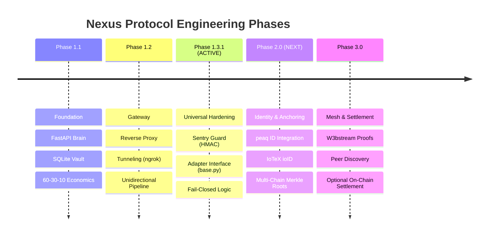

# 🛣️ Engineering Roadmap — Nexus Protocol

This document tracks the evolution of the **Nexus Universal Gateway**. The roadmap is strictly phased to ensure architectural correctness before feature expansion.

> [!NOTE]
> **Roadmap Disclaimer:** This represents an engineering dependency plan. Later phases (specifically Phase 2.0+) are contingent on system correctness, security audits, and ecosystem grant availability.

**Current Status:** ```PHASE 1.3.1 — UNIVERSAL HARDENING (ACTIVE)```
**Primary Focus:** Sentry Hardening & Adapter Interface Standardization

---

## 📅 Roadmap Overview



---

## 🚫 Non-Goals (Explicitly Out of Scope)
To preserve architectural integrity, the following are **not** objectives of the current development cycle:
* **Live Mainnet Settlement** (Phase 1.x is Local-First only).
* **Token Issuance** or speculative mechanics.
* **Permissionless Mesh Networking** (prior to Identity Hardening).

---

## ✅ Phase 1.1 — Sovereign Foundation (Closed)
* [x] **Brain:** FastAPI backend execution engine.
* [x] **Vault:** SQLite database with WAL mode persistence.
* [x] **Economics:** Deterministic 60-30-10 execution.

---

## ✅ Phase 1.2 — Gateway Architecture (Closed)
* [x] **Gateway Pattern:** Brain (Port 8000) is the sole public interface.
* [x] **Reverse Proxy:** Brain routes to Body (Port 8080) internally.
* [x] **Ngrok Support:** Validated tunneling for mobile/cloud orchestrators.

---

## 🔵 Phase 1.3.1 — Universal Hardening (Active)
**Core Question:** *Is the architecture modular enough to support any chain safely?*

* [x] **Sentry Guard:** Implementation of ```sentry.py``` for signature validation.
* [x] **Fail-Closed Security:** Unauthorized requests are rejected at the perimeter.
* [x] **Universal Adapter Interface:** Creation of ```adapters/base.py``` abstract class.
* [x] **Reference Adapter (TON):** Validation of the adapter interface using a lightweight, message-oriented chain.
* [ ] **Observability:** Structured rejection telemetry for Sentry events (local logs, no external export).
* [ ] **Adapter Specs:** Finalizing interface requirements for **peaq** and **IoTeX**.

---

## 🔮 Phase 2.0 — Identity & DePIN Readiness (Next)
**Core Question:** *Who owns the state, and can we verify hardware identity?*

* [ ] **peaq Integration:**
    * Implementation of **peaq ID** (Sr25519) verification in the Sentry.
    * Anchoring machine state roots to the peaq testnet.
* [ ] **IoTeX Integration:**
    * Support for **ioID** (Ed25519) signatures.
    * Preparation of data schemas for **W3bstream**.
* [ ] **Client Signing:** Body signs requests; Brain verifies signatures locally.
* [ ] **Multi-Chain Merkle Anchoring:** submitting local state roots to multiple chains simultaneously.

---

## 🔮 Phase 3.0 — Mesh & Settlement (Future)
* [ ] **W3bstream Integration:** Porting Sentry logs to IoTeX W3bstream for off-chain proofs.
* [ ] **Peer Discovery:** DHT-based node finding.
* [ ] **Automated Settlement:** Optional claim logic via Smart Contracts (post-audit).

---

## 📊 Phase Summary Table

| Phase | Name | Core Question | Status |
| :--- | :--- | :--- | :--- |
| **1.1** | Foundation | Can it run locally? | ✅ **Closed** |
| **1.2** | Gateway | Is it consistent? | ✅ **Closed** |
| **1.3.1** | **Universal Hardening** | **Is it modular?** | 🔵 **Active** |
| **2.0** | **Identity** | **Who owns the data?** | 🔮 **Grant Target** |
| **3.0** | Mesh | How to coordinate? | 🔮 **Future** |

---

© 2026 Nexus Protocol · Licensed under **Apache License 2.0**
