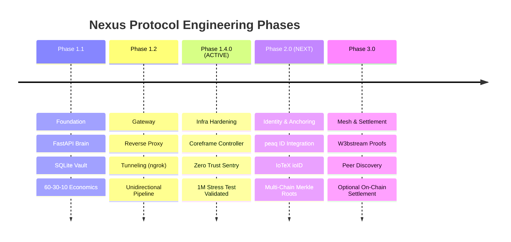

# 🛣️ Engineering Roadmap — Nexus Protocol
**Coreframe Systems Lab | Version 1.4.0**

This document tracks the evolution of the **Nexus Universal Gateway**. The roadmap is strictly phased to ensure architectural correctness and "durability-first" stability before feature expansion.

> [!NOTE]
> **Roadmap Disclaimer:** This represents an engineering dependency plan. Phase 2.0+ development is contingent on architectural validation, security audits, and ecosystem grant availability.

**Current Status:** ```PHASE 1.4.0 — INFRASTRUCTURE HARDENING (ACTIVE)```  
**Primary Focus:** Ingress Agnosticism & Production-Ready Sovereign Nodes

---

## 📅 Roadmap Overview



---

## 🔵 Phase 1.4.0 — Infrastructure Hardening (Active)
**Core question:** *Is the node stable enough for production deployment?*

* [x] **Universal Adapter Interface:** Abstract ```BaseAdapter``` implemented for cross-chain modularity.
* [x] **Zero Trust Sentry:** Implementation of hardened ingress logic (Cloudflare reference implementation; ingress-agnostic).
* [x] **Durability Benchmark:** 1-Million Transaction stress test validated (0% corruption, 50-60 TPS baseline).
* [x] **Master Controller:** Deployment of the ```start_nexus.bat``` management suite.
* [x] **Fail-Closed Perimeter:** Deterministic identity resolution and unauthorized request rejection.
* [ ] **Observability:** Finalizing local structured telemetry for Sentry rejection events.
* [ ] **Adapter Finalization:** Interface specs finalized for **peaq** and **IoTeX** (Phase 2 readiness).

---

## 🔮 Phase 2.0 — Identity & DePIN Readiness (Next)
**Core question:** *Who owns the state, and can we verify hardware identity?*

* [ ] **Sovereign Identity:** Support for reference adapters (peaq ID, IoTeX ioID) as optional, non-mandatory runtime dependencies.
* [ ] **peaq Integration:**
    * Implementation of **peaq ID** (Sr25519) verification in the Sentry.
    * Anchoring machine state roots to the peaq testnet.
* [ ] **IoTeX Integration:**
    * Support for **ioID** (Ed25519) signatures.
    * Preparation of data schemas for **W3bstream**.
* [ ] **Multi-Chain Merkle Anchoring:** Submitting local state roots to multiple chains simultaneously for global cryptographic finality.


---

## 📊 Phase Summary Table

| Phase | Name | Core Question | Status |
| :--- | :--- | :--- | :--- |
| **1.1** | Foundation | Can it run locally? | ✅ **Closed** |
| **1.2** | Gateway | Is it consistent? | ✅ **Closed** |
| **1.4.0** | **Infra Hardening** | **Is it production-ready?** | 🔵 **Active** |
| **2.0** | **Identity** | **Who owns the data?** | 🔮 **Grant Target** |

---
© 2026 Coreframe Systems · Licensed under **Apache License 2.0**
