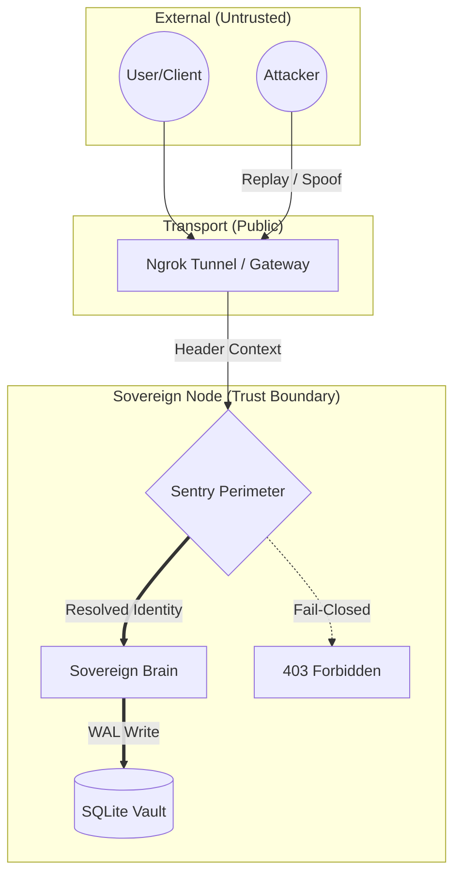

# 🛡️ Threat Model — Nexus Protocol (Phase 1.3.1)

This document defines the **explicit threat surface** and **security assumptions** of the Nexus Protocol **as implemented in Phase 1.3.1**.

> [!CAUTION]
> **Scope Disclaimer**
> This threat model applies **only** to Phase 1.3.1. Future features (cryptographic identity, mesh networking, on-chain anchoring) are **out of scope**.

---

## 🎯 Security Objective

> **To preserve the integrity of the local economic ledger under adversarial request conditions, while failing closed on identity ambiguity.**

---

## 🛰️ Threat Surface Visualization

---

## 🧱 System Boundaries (Phase 1.3.1)

### In-Scope Components
- **Sovereign Brain:** FastAPI runtime & SQLite vault (WAL mode).
- **Execution Surface:** Flutter Web UI / Telegram Mini App context.
- **Sentry Perimeter (Staged):** Header-based context extraction & deterministic fallback logic.
- **Local Hardware:** The physical/virtual environment of the Node Operator.

### Explicitly Out of Scope
- Cryptographic identity enforcement (peaq ID / ioID / TON signatures).
- Asset custody (private keys or on-chain wallets).
- P2P networking or cross-node consensus.

---

## ⚠️ Identified Threats & Mitigations

### 1. Economic Tampering
**Threat:** Client attempts to alter the 60/30/10 split via request injection.  
**Mitigation:** - Split logic is enforced **server-side only** within the Brain.
- No client-side authority over ledger commit rules.

### 2. Unauthorized Ledger Writes
**Threat:** Requests without valid context attempting to write to the vault.  
**Mitigation:** - **Fail-Closed Identity Resolution:** Requests without a resolvable namespace are rejected (403).

### 3. Database Corruption
**Threat:** Concurrent writes or system crashes corrupting the ledger.  
**Mitigation:** - **SQLite WAL Mode:** Ensures atomicity and durability.
- **Verified Scale:** Validated under **1-Million Transaction Stress Test**.

### 4. Replay Attacks (Deferred)
**Threat:** Reuse of valid requests to inflate ledger entries.  
**Mitigation:** Deferred to Phase 2.0 via signed nonces and cryptographic identity enforcement.

### 5. Denial of Service (Accepted Risk)
**Threat:** Flooding the API to exhaust local hardware resources.  
**Mitigation:** Rate limiting is not enforced in Phase 1.3.1 and is delegated to the node operator.

---

## 🔐 Non-Goals (Explicit)

Nexus Phase 1.3.1 **does not attempt** to:
- Prove real-world identity (Deferred to Phase 2.0).
- Prevent node operators from modifying their own local data.
- Detect Sybil behavior or collusion in this phase.

---

## 📊 Verified Security Properties

| Property | Status |
|---|---|
| Ledger Integrity | ✅ **Verified (1M Stress Test)** |
| Deterministic Execution | ✅ **Verified** |
| Crash Resilience | ✅ **Verified (WAL Mode)** |
| Fail-Closed Behavior | ✅ **Verified** |
| Identity Enforcement | ❌ **Deferred to Phase 2.0** |

---

© 2026 Nexus Protocol · Threat Model Specification v1.3.1  
Licensed under the Apache License 2.0
