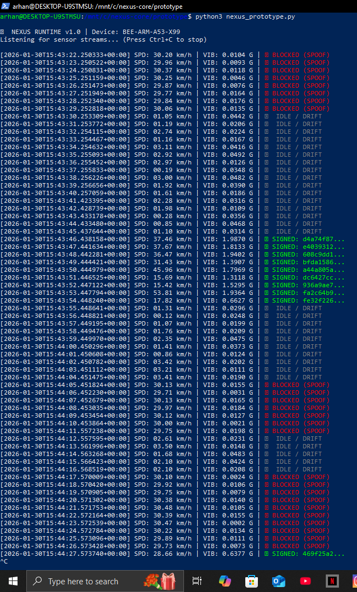



# Nexus Gatekeeper: Edge Verification Runtime (Simulation)

> **Deployment Target:** ARMv8 (Cortex-A53 / Hivemapper Bee)  
> **Status:** Functional Simulation (BEE-ARM-A53-X99)  
> **Objective:** Pre-ingest filtering to reduce cloud ingest and reward leakage by ~15–20%.

---

## ⚡ Overview

Nexus is a lightweight edge-resident gatekeeper designed to run alongside dashcam firmware. It validates **physical motion consistency** before mapping data enters the upload pipeline.

**Threat Model:** Low-effort GPS spoofing using desk-bound simulators (constant velocity, zero vibration).

**Mitigation Strategy:** Correlate GNSS-reported velocity with real-time IMU vibration entropy. If physical motion does not match claimed motion, the data packet is dropped locally.

**Fail-Closed Guarantee:** If the Nexus process halts or loses heartbeat, the upload pipeline is disabled. No unsigned or unverified data can enter the network.

  
*Runtime output distinguishing IDLE states, validated drives (green), and simulator spoofing (red).*

---

## 🏗️ Architecture: Verify_Motion_Correlation()

Nexus enforces a deterministic physical consistency check:

1. **GNSS Velocity Check:** Evaluate claimed speed against a motion threshold (>10 km/h).
2. **IMU Entropy Check:** Measure vibration RMS and entropy from accelerometer data.
3. **Decision Gate:** If speed exceeds threshold while vibration remains below the configured floor, the packet is blocked locally.

```python
# Simplified Logic
if gps_velocity_kmh > 10.0:
    if imu_vibration_grms < VIBRATION_THRESHOLD_G:
        upload_allowed = False
        status = "BLOCKED (SPOOF)"
```

---

## 🛠️ Hardware Footprint (ARM Cortex-A53)

Designed for safe coexistence with primary mapping workloads:
- **CPU Overhead:** <2% sustained (single core @ ~1.2 GHz)
- **Memory Footprint:** ~35 MB RSS
- **Security Model:** Production builds are designed to bind session material to ARM TrustZone or a secure element. Keys are not intended to reside in user-accessible memory.

---

## 🚀 Simulation Quickstart

The simulation cycles through three states: Real-world driving, Simulator-based spoofing, and Idle / GPS drift.

```bash
# Run on Linux / WSL
python3 nexus_prototype.py
```

---

Orthonode Infrastructure Labs™ is a technical brand and research initiative of **Orthonode Infrastructure Labs Private Limited**, Madhya Pradesh, India (NIC 72900).
---
© 2026 Orthonode Infrastructure Labs™ · All Rights Reserved
Orthonode Infrastructure Labs™ is a technical brand and research initiative of **Orthonode Infrastructure Labs Private Limited**, Madhya Pradesh, India (NIC 72900).


