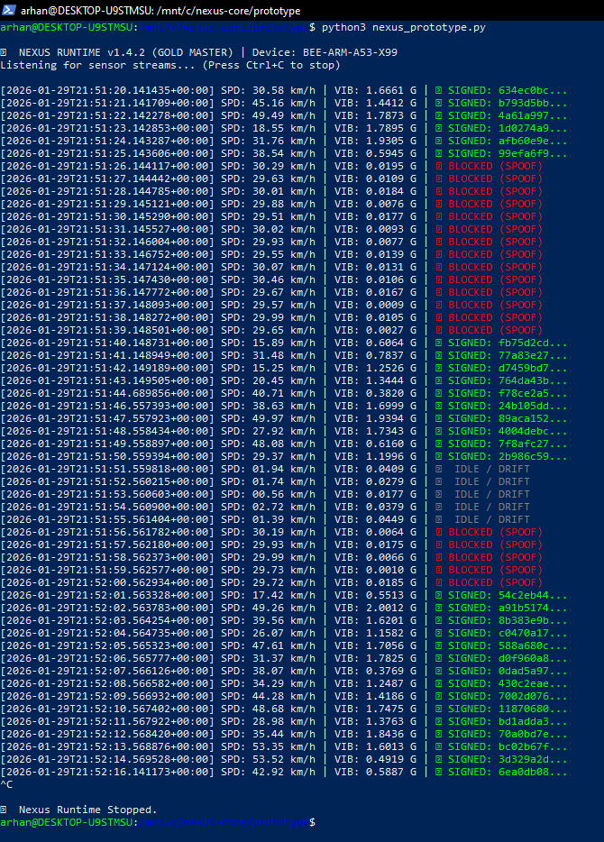

# Nexus Gatekeeper: Edge Verification Prototype (v1.4.1)

> **Status:** Edge Runtime Simulation (Daemon-Level)
> **Target Hardware:** ARM Cortex-A53 (Hivemapper Bee)  
> **Objective:** Pre-upload validation of mapping data to reduce cloud ingest costs.

---

## ⚡ Overview
This prototype demonstrates the **"Verify-then-Execute"** logic used by the Nexus Protocol. It runs as a lightweight daemon on the edge device, analyzing raw sensor streams (GNSS + IMU) in real-time.

**The Problem:** Current mapping networks upload 100% of data and filter bad actors in the cloud. This wastes bandwidth and compute.  
**The Solution:** Nexus blocks "Low-Effort Spoofing" (e.g., GPS Simulators) locally. If the physics don't match reality, the data is dropped before upload.

**Failure Mode:** If Nexus is unavailable or crashes, the upload pipeline halts (fail-closed), preventing unsigned data from entering the network.


*Above: v1.4.2 Logic distinguishing between valid driving (Green) and zero-vibration spoofing (Red).*

---

## 🌍 Global Configuration (The "Road Variance" Problem)
Road quality varies drastically by region. A threshold calibrated for a German Autobahn will yield false negatives on a rural road in India. Nexus uses a configurable **Regional Profile**.

### `VIBRATION_THRESHOLD_G`
* **Default (0.12 G):** Optimized for standard city driving (US/EU).
* **Smooth Profile (0.05 G):** Required for high-end EVs (Tesla/Lucid) or freshly paved highways (Germany/Switzerland).
* **Rough Profile (0.25 G):** Optimized for off-road or high-texture environments (Rural India/Africa).

**Implementation Note:**
In production, this value is dynamically pulled from the device's `config.json` based on the GPS Geofence.

```python
# snippet from nexus_prototype.py
if region == "EU_GERMANY":
    VIBRATION_THRESHOLD_G = 0.05
elif region == "IN_MUMBAI":
    VIBRATION_THRESHOLD_G = 0.20
```

---

## 🛠️ How to Run Simulation
This script simulates 3 states: **Real Drive**, **Simulator Attack**, and **Idle/Drift**.

**Prerequisites:**
* Python 3.8+
* Standard Libraries (No `pip install` required)

**Command:**
```bash
python3 nexus_prototype.py
```

---

## ❓ Technical FAQ

**Q: Does this block legitimate stopped cars?**
**A:** No. The logic includes a `SPEED_THRESHOLD_KMH` (8.0 km/h). If the car is stopped (traffic light), Nexus enters `IDLE` state. It only "Blocks" if the GPS says "Moving Fast" but the Accelerometer says "Zero Movement."

**Q: How do you handle EVs (Electric Vehicles)?**
**A:** EVs produce less vibration than combustion engines. We have lowered the validation floor to `0.12 G` and rely on low-amplitude vibration entropy correlated with speed, rather than engine rumble.

**Q: Where are the keys stored?**
**A:** In this prototype, the session key is hardcoded for demonstration. In the production build, keys are generated inside the ARM TrustZone or ATECC608 Secure Element and never exposed to the OS.

---

**© 2026 Nexus Protocol.** *Sovereign Infrastructure Lab.*
